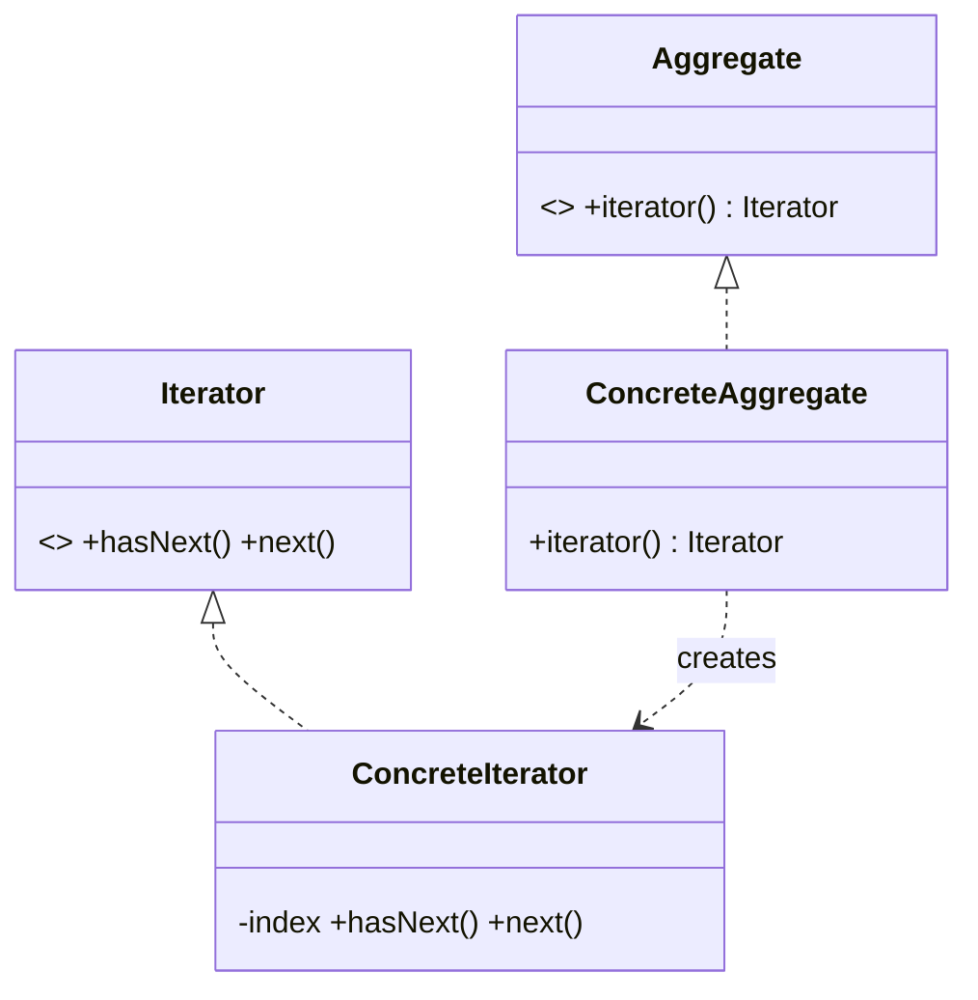

# Iterator Pattern — Concept

## What Is It?

**Iterator** provides a way to access the elements of a collection **sequentially** without exposing its underlying representation. It moves traversal logic out of the aggregate, so the same collection can be walked in different ways and clients never depend on the internal data structure.

---

## When to Use

> **Trigger keywords:** "traverse", "loop over", "iterate", "without exposing internals", "sequential access", "collection", "next element"

| Trigger | Example |
|---------|---------|
| Walk a collection **without exposing internals** | Playlist → songs |
| Provide **multiple traversal orders** | In-order / pre-order tree walk |
| Custom collection types | Ring buffer, LRU list |
| **Lazy / streaming** access | Generate on demand |

---

## Structure



- **Iterator** — `hasNext()` / `next()` (Java adds `remove()`)
- **ConcreteIterator** — tracks traversal state
- **Aggregate** — `iterator()` factory method
- **ConcreteAggregate** — returns its iterator

---

## Variants

### 1. External Iterator
Client drives the loop (`while (it.hasNext()) it.next();`). Most flexible.

### 2. Internal Iterator
The collection applies an operation to each element (`for-each`, `forEach`). Simpler, less control.

### 3. Java's `Iterable` / `Iterator`
Implements the `java.lang.Iterable` contract so your class works with for-each.

### 4. Fail-fast
Concurrent modification while iterating throws `ConcurrentModificationException` (e.g. `ArrayList`).

---

## Visual Walkthrough

```java
// without Iterator — the client knows the internal array
for (int i = 0; i < playlist.songsArray.length; i++) { ... }

// with Iterator — internal representation is hidden
for (Song s : playlist) { ... }        // playlist implements Iterable<Song>
Iterator<Song> it = playlist.iterator();
while (it.hasNext()) { Song s = it.next(); }
```

---

## Trade-offs

| | Direct traversal | Iterator |
|---|---|---|
| Encapsulation | ❌ exposes internals | ✅ hides structure |
| Multiple orders | hard | ✅ one iterator each |
| Concurrent modification | N/A | needs care (fail-fast / fail-safe) |

---

## Common Mistakes

1. **Concurrent modification** — mutating a list while iterating throws `ConcurrentModificationException`; use `Iterator.remove()` or a fail-safe collection.
2. **Iterator invalidation** — reusing an exhausted iterator; create a new one.
3. **Exposing the internal collection** — that defeats the pattern's purpose.
4. **Shared iterator state across threads** — iterators are typically not thread-safe.
5. **Forgetting `hasNext()` checks** — always guard `next()`.

---

## Related Patterns

- [[../../Structural/08 - Composite/Concept|Composite]] — iterators traverse composite trees
- [[../19 - Visitor/Concept|Visitor]] — run operations while iterating
- [[Concept|Iterator]] composes cleanly with [[../14 - Observer/Concept|Observer]] for streams

---

#iterator #behavioural #lld #concept