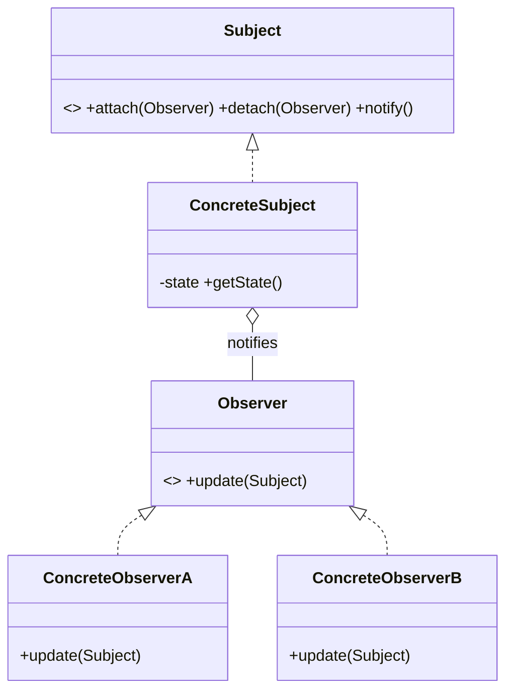

# Observer Pattern — Concept

## What Is It?

**Observer** defines a **one-to-many** dependency: when one object (the **subject** / publisher) changes state, all its dependents (**observers** / subscribers) are **notified automatically**. It decouples the publisher from an unknown, changing set of subscribers.

---

## When to Use

> **Trigger keywords:** "notify", "subscribe", "listeners", "event", "publish", "on change", "when X happens", "broadcast"

| Trigger | Example |
|---------|---------|
| One change must **notify many** | Stock price → all investors |
| **Unknown / dynamic** set of subscribers | Event bus, UI listeners |
| Loose coupling between modules | Order placed → email + inventory + analytics |
| **Pub-sub** messaging | Chat rooms, notifications |

---

## Structure



- **Subject** — register / unregister / notify
- **Observer** — `update()` callback
- **ConcreteSubject** — holds state, fires notifications
- **ConcreteObserver** — reacts to changes

---

## Variants

### 1. Push model
The subject sends the data in `update(data)` — simple, but couples observers to the payload.

### 2. Pull model
`update()` is a signal; the observer calls `subject.getState()` — more flexible, extra calls.

### 3. Async dispatch
Notify on a separate executor/queue so a slow observer cannot block the publisher.

### 4. Weak references
Store observers weakly to avoid **memory leaks** when observers forget to detach.

---

## Visual Walkthrough

```
Stock (subject) price changes
      │ notify()
      ├──► Investor A.update()  → "A: price 120"
      ├──► Investor B.update()  → "B: price 120"
      └──► DisplayBoard.update() → re-render
```

Adding a new observer requires **no change** to the subject.

---

## Trade-offs

| | Polling | Observer |
|---|---|---|
| Coupling | medium | low |
| Latency | periodic delay | immediate |
| Risk | wasted checks | memory leaks / loops |

---

## Common Mistakes

1. **Memory leaks** — forgetting to `detach()` keeps observers alive; consider weak references.
2. **`ConcurrentModificationException`** — an observer registering/unregistering during `notify()`; iterate over a **copy** (or use `CopyOnWriteArrayList`).
3. **Notification loops** — an observer that mutates the subject and re-triggers `notify()`.
4. **Slow synchronous observers** — one blocking `update()` stalls all others; use async dispatch.
5. **Order dependence** — never rely on the notification order of observers.

---

## Related Patterns

- [[../20 - Mediator/Concept|Mediator]] — centralises communication that Observer broadcasts
- [[../16 - Command/Concept|Command]] — an event queue can carry commands
- [[../17 - State/Concept|State]] — a state change often triggers notifications

---

#observer #behavioural #lld #concept