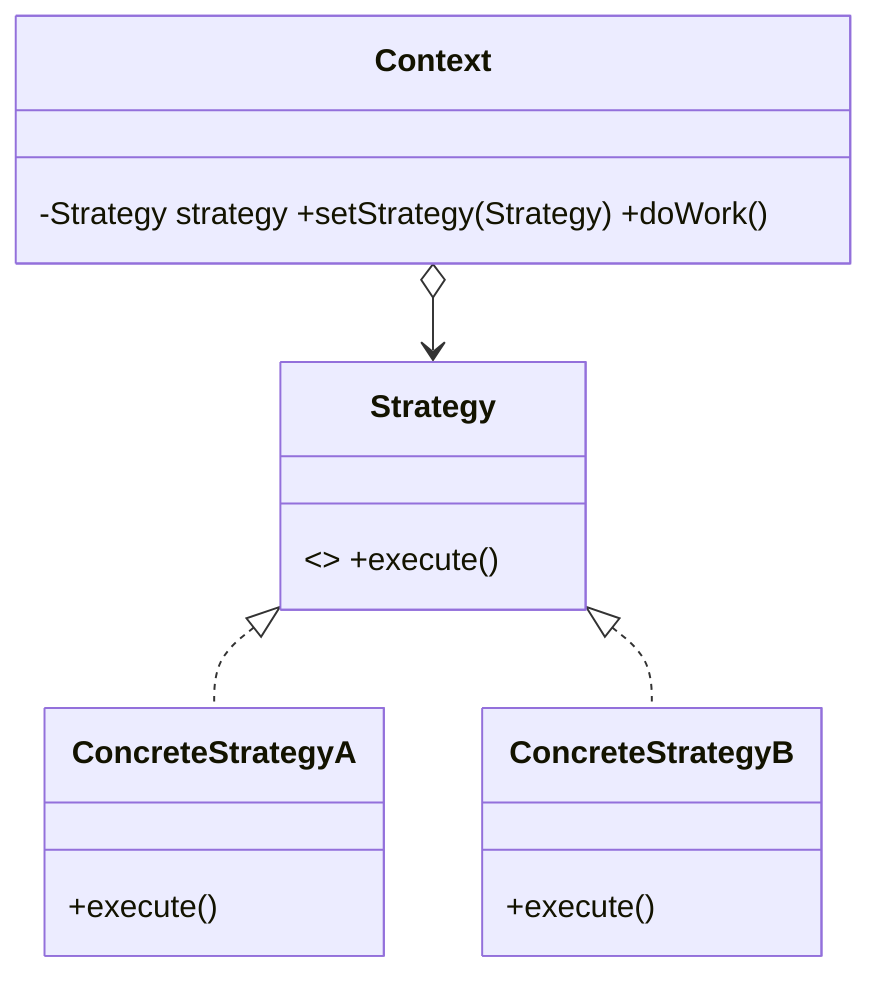

# Strategy Pattern — Concept

## What Is It?

**Strategy** defines a **family of algorithms**, encapsulates each one, and makes them **interchangeable** at runtime. The **Context** delegates to a `Strategy` object, so the algorithm can vary independently of the clients that use it — and it removes `if/else`/`switch` chains for behaviour selection.

---

## When to Use

> **Trigger keywords:** "different ways", "algorithm", "interchangeable", "pluggable", "policy", "swappable", "at runtime"

| Trigger | Example |
|---------|---------|
| **Multiple algorithms** for one task | Sort, compress, price |
| Behaviour chosen **at runtime** | Payment method, shipping mode |
| Replace a growing **`if/else` / `switch`** | Discount rules |
| **Isolate** a frequently-changing rule | Tax policy per country |

---

## Structure



- **Context** — holds a Strategy and delegates to it
- **Strategy** — the common algorithm interface
- **ConcreteStrategy** — one algorithm each

---

## Variants

### 1. Classic Strategy
A `Context` with a settable `Strategy` field.

### 2. Functional Strategy
Since Java 8, a strategy is often a `BiFunction`, `Comparator`, or a lambda — no class per algorithm.
```java
Comparator<Item> byPrice = Comparator.comparing(Item::price);
```

### 3. Injected Strategy
The strategy is chosen by a factory/DI and injected into the context.

---

## Visual Walkthrough

```java
// ❌ Before — grows with every new method
if (method.equals("CARD")) chargeCard(amount);
else if (method.equals("UPI")) chargeUpi(amount);
else if (method.equals("PAYPAL")) chargePaypal(amount);

// ✅ After — open for extension, closed for modification
PaymentStrategy strategy = PaymentStrategyFactory.of(method);
checkout.setStrategy(strategy);
checkout.pay(amount);
```

---

## Trade-offs vs State / Bridge

| Pattern | Same shape? | Intent |
|---------|-------------|--------|
| **Strategy** | yes | select **one** interchangeable algorithm |
| **State** | yes | object **transitions itself** between states |
| **Bridge** | yes | separate **two** hierarchies so both vary |

Strategy is chosen **by the client**; State changes **itself** on events.

---

## Common Mistakes

1. **Confusing Strategy with State** — Strategy = interchangeable algorithms chosen by the client; State = internal transitions.
2. **Leaking selection logic into the Context** — the `if/else` reappears in the context instead of a factory/map.
3. **Stateful strategies** — keep strategies stateless (or make them immutable) so they can be shared.
4. **Overuse** — a single algorithm does not need a Strategy.
5. **Static strategy by default** — you lose the runtime flexibility that justified the pattern.

---

## Related Patterns

- [[../17 - State/Concept|State]] — same structure, self-transitioning behaviour
- [[../../Structural/07 - Bridge/Concept|Bridge]] — two independent hierarchies
- [[../../Creational/02 - Factory Method/Concept|Factory Method]] — often selects the strategy

---

#strategy #behavioural #lld #concept