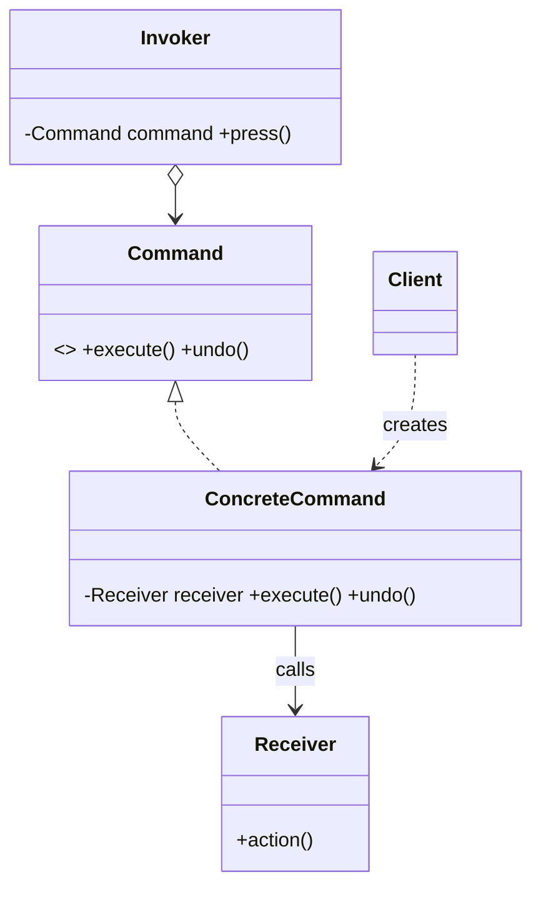

# Command Pattern — Concept

## What Is It?

**Command** encapsulates a **request as an object**. This lets you **parameterise** clients with requests, **queue** or **log** them, and support **undo/redo** — because the request's details now live in a first-class object rather than being buried in a method call.

---

## When to Use

> **Trigger keywords:** "undo / redo", "queue", "schedule", "execute later", "log requests", "macro", "remote control", "invoker"

| Trigger | Example |
|---------|---------|
| **Undo / redo** | Text editor, drawing app |
| **Queue / schedule** tasks | Job queue, task scheduler |
| **Parameterise** operations | Button wired to an arbitrary action |
| **Log / replay** requests | Transaction log, macros |
| **Decouple** invoker from receiver | Remote control → light/AC |

---

## Structure



- **Command** — `execute()` (and optionally `undo()`)
- **ConcreteCommand** — binds a Receiver + parameters
- **Invoker** — triggers the command (button, scheduler)
- **Receiver** — the object that does the real work
- **Client** — builds and wires commands

---

## Variants

### 1. Basic Command
`execute()` only.

### 2. Undoable Command
Each command stores the state needed to `undo()`.

### 3. Macro Command
A composite command holding a list of commands (execute all / undo all in reverse).

### 4. Queued Command
Commands pushed to a queue and executed by a worker (job scheduling).

---

## Visual Walkthrough

```
Client → TurnOnCommand(light) → Invoker(Remote)
                                    │ press()
                                    ▼
                           command.execute() → light.on()
                                    │
                            undo() → light.off()
```

The remote never knows what a "light" is — it only knows `Command`.

---

## Trade-offs

| | Direct call | Command |
|---|---|---|
| Undo / queue / log | ❌ | ✅ |
| Classes | few | one per operation |
| Decoupling | low | high |

---

## Common Mistakes

1. **Confusing Command with Strategy** — Strategy picks *how* to do one thing; Command encapsulates *a request* (do/undo, queueable).
2. **Forgetting to store undo state** — an `undo()` with no saved state is wrong.
3. **Putting receiver logic in the command** — the command delegates to the **Receiver**.
4. **Unbounded undo history** — cap the history to avoid memory growth.
5. **Not restoring state on undo** — ensure `undo()` fully reverses `execute()`.

---

## Related Patterns

- [[../15 - Strategy/Concept|Strategy]] — swap one algorithm vs encapsulate a request
- [[../../Structural/08 - Composite/Concept|Composite]] — a **Macro command** is a composite of commands
- [[../21 - Memento/Concept|Memento]] — store state snapshots to support undo

---

#command #behavioural #lld #concept