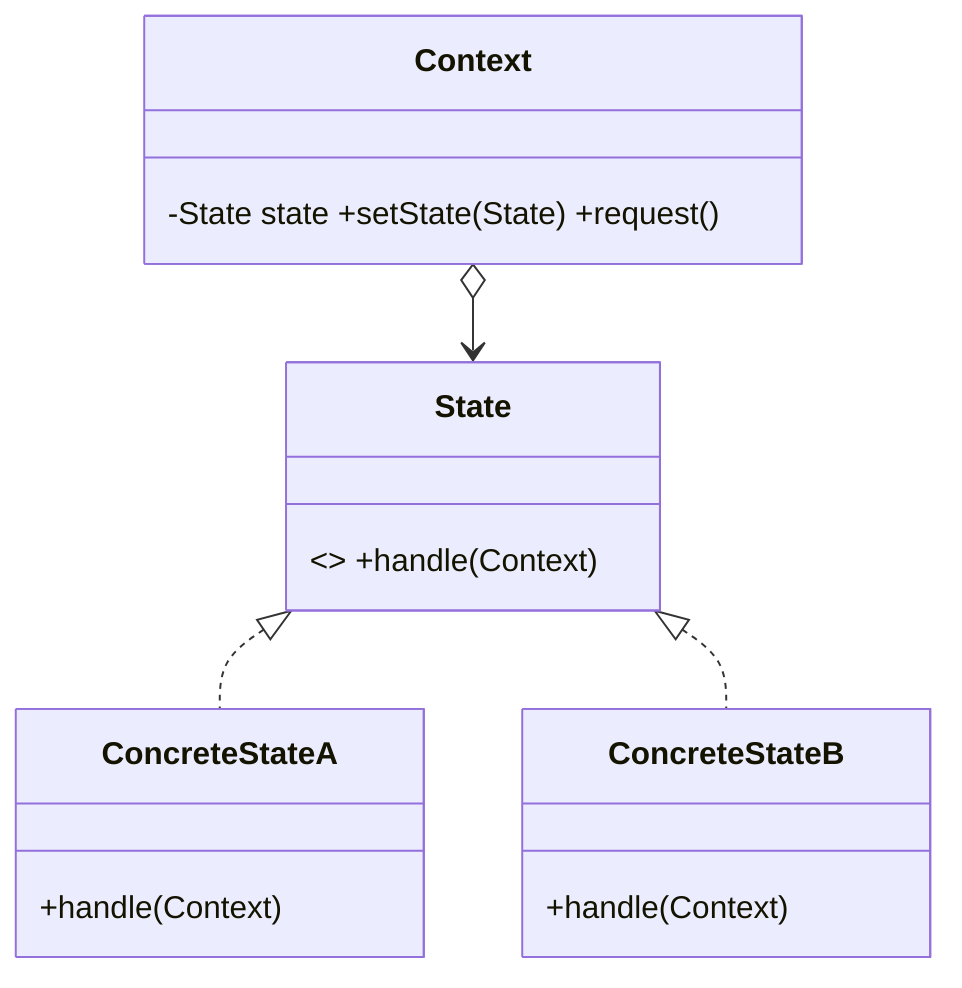

# State Pattern — Concept

## What Is It?

**State** lets an object **alter its behaviour when its internal state changes** — the object appears to change its class. Instead of a giant `switch` on a status field, each state becomes its own class that defines the behaviour *and* the legal transitions out of that state.

---

## When to Use

> **Trigger keywords:** "state", "status", "lifecycle", "transition", "changes behaviour", "mode", "phase"

| Trigger | Lifecycle |
|---------|-----------|
| Object with a **rich lifecycle** | Order: NEW → PAID → SHIPPED → DELIVERED |
| Behaviour **depends on state** | ATM: idle / hasCard / dispensing |
| Many **illegal transitions** to guard | Vending machine |
| Modes with different logic | Media player: playing / paused / stopped |

---

## Structure



- **Context** — holds the current State and delegates behaviour to it
- **State** — declares the behaviour for a state
- **ConcreteState** — implements behaviour and triggers transitions

---

## Variants

### 1. Enum + `switch` (simple)
Fine for 2–3 states with trivial logic; grows unmanageable quickly.

### 2. State objects (GoF, recommended at scale)
Each state is a class; transitions live inside states.

### 3. Table-driven
A `Map<State, Map<Event, State>>` defines legal transitions declaratively.

---

## Visual Walkthrough

```
[New] --pay--> [Paid] --ship--> [Shipped] --deliver--> [Delivered]
  │              │                 │
  └──cancel──►  [Cancelled]  ←─────┘

Each arrow is a method call on the current State object; illegal arrows throw.
```

---

## Trade-offs vs Strategy

| Pattern | Same shape? | Who decides the change? | Purpose |
|---------|-------------|------------------------|---------|
| **State** | yes | the **state itself** on an event | model a lifecycle |
| **Strategy** | yes | the **client** | pick an algorithm |
| **Bridge** | yes | configured up front | separate two hierarchies |

State usually tracks a *current* state and **transitions itself**; Strategy is swapped by the caller.

---

## Common Mistakes

1. **Confusing State with Strategy** — State is about *lifecycle transitions*; Strategy about *interchangeable algorithms*.
2. **Giant `switch` on state** — the exact problem State solves.
3. **Transition explosion** — model transitions in a table or inside states, not all in the context.
4. **Shared mutable state** — state objects should be stateless and shareable.
5. **Leaking the current state** — expose intent (`pay()`) not the internal status string.

---

## Related Patterns

- [[../15 - Strategy/Concept|Strategy]] — interchangeable algorithms (client-selected)
- [[../16 - Command/Concept|Command]] — state transitions are often triggered by commands
- [[../21 - Memento/Concept|Memento]] — snapshot/restore state

---

#state #behavioural #lld #concept