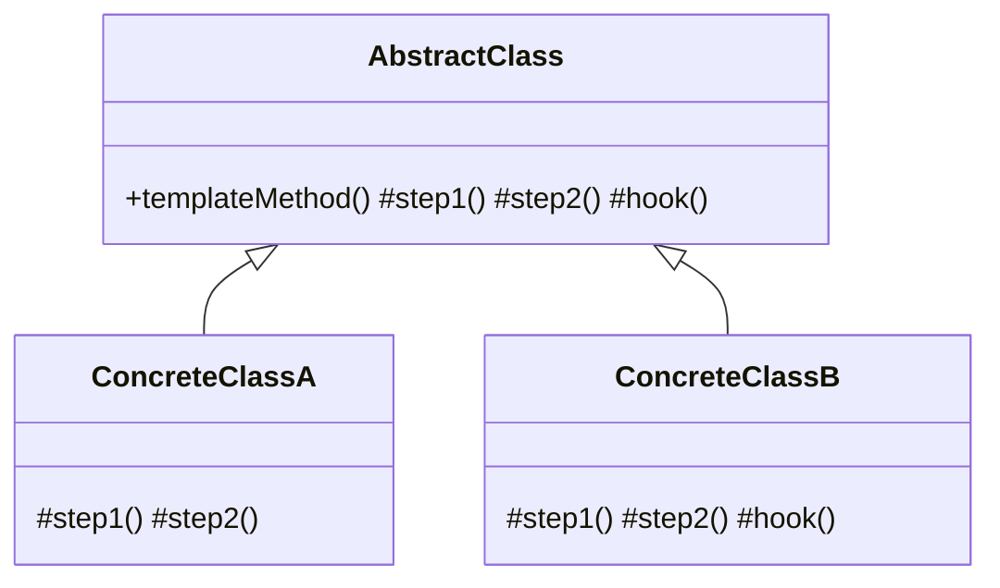

# Template Method Pattern — Concept

## What Is It?

**Template Method** defines the **skeleton of an algorithm** in a base method, deferring some steps to subclasses. The base class controls the sequence; subclasses fill in the variable steps without changing the overall structure — the **Hollywood Principle** ("don't call us, we'll call you").

---

## When to Use

> **Trigger keywords:** "skeleton", "steps in the same order", "varying steps", "hook", "framework", "pipeline", "shared algorithm"

| Trigger | Example |
|---------|---------|
| **Same steps, different details** | Brew tea vs brew coffee |
| A **framework** provides an extension point | `InputStream`, `JdbcTemplate` |
| **Enforce a sequence** | Parse → transform → validate → save |
| Avoid duplicated **algorithm structure** | Report generation |

---

## Structure



- **AbstractClass** — `templateMethod()` (usually `final`) calls primitive operations and hooks
- **ConcreteClass** — overrides the primitive steps / optional hooks

---

## Variants

### 1. Abstract steps (must implement)
Declared `abstract` — every subclass must define them.

### 2. Hooks (optional)
Empty/`default` methods subclasses *may* override — Extension points with sensible defaults.

### 3. Template with a factory method
The template calls an abstract `createSomething()` — Template Method + Factory Method together.

---

## Visual Walkthrough

```
templateMethod():                 // fixed order, base class owns it
  1. prepare()                    // abstract → subclass
  2. brew()                       // abstract → subclass
  3. pour()                       // abstract → subclass
  4. addCondiments()              // hook (optional)
  5. cleanUp()                    // hook (optional)
```

The subclass customises steps 1–4 but can never reorder them.

---

## Trade-offs vs Strategy

| | Template Method | Strategy |
|---|---|---|
| Variation | via **inheritance** | via **composition** |
| Binding | compile-time (subclass) | runtime (swap object) |
| Coupling | subclass ↔ base | low |
| Use for | fixed skeleton, varying steps | interchangeable whole algorithm |

---

## Common Mistakes

1. **Too many steps** — a rigid template becomes brittle; keep it small.
2. **Not making the template `final`** — subclasses can break the skeleton.
3. **Forgetting the Hollywood principle** — the base class calls the subclass, not vice versa.
4. **Hooks with side effects** — document whether a hook is called before/after.
5. **Using inheritance when composition (Strategy) is cleaner** — prefer Strategy for swappable algorithms.

---

## Related Patterns

- [[../15 - Strategy/Concept|Strategy]] — composition-based algorithm swapping
- [[../../Creational/02 - Factory Method/Concept|Factory Method]] — a common step inside a template
- [[Concept|Template Method]] often hosts [[../14 - Observer/Concept|Observer]] hooks

---

#template-method #behavioural #lld #concept