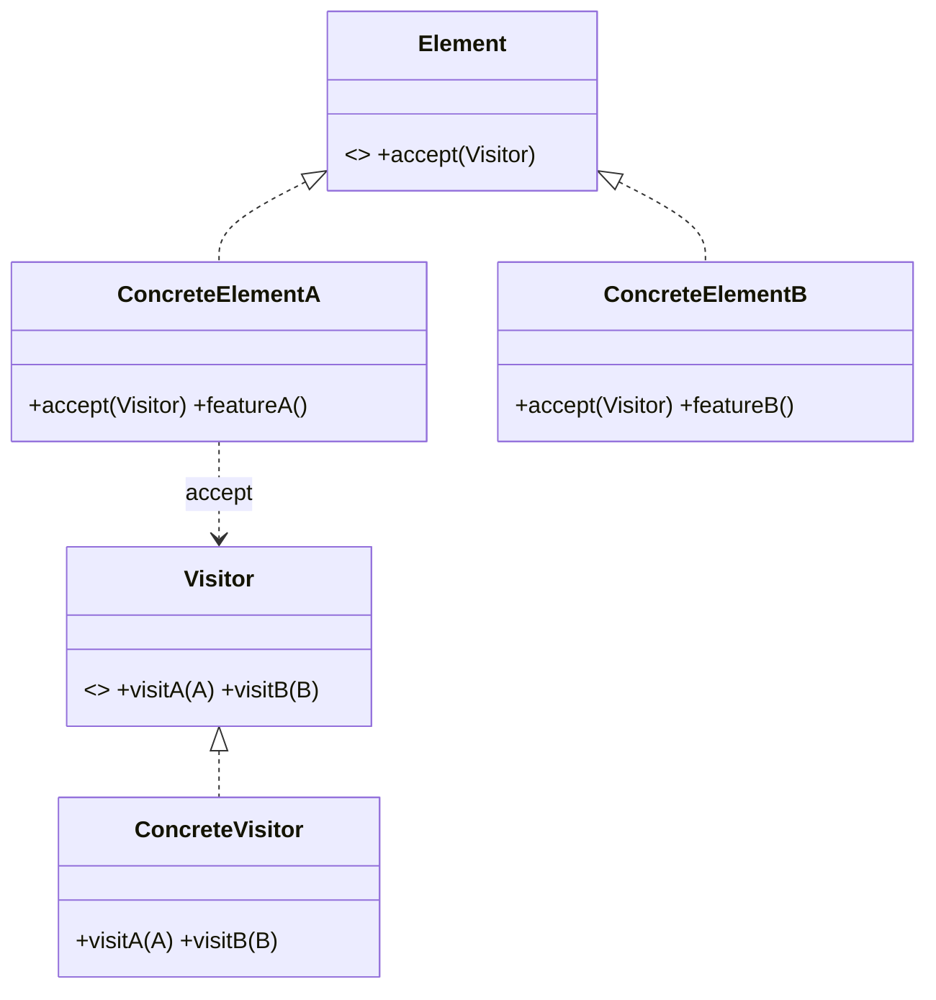

# Visitor Pattern — Concept

## What Is It?

**Visitor** represents an **operation to be performed on the elements of an object structure**. It lets you **add new operations without changing the element classes** — the classic answer to "I have a stable set of types but keep needing new things to do with them". It relies on **double dispatch**.

---

## When to Use

> **Trigger keywords:** "add new operations", "without modifying classes", "traverse a structure", "many operations on stable types", "AST", "double dispatch"

| Trigger | Example |
|---------|---------|
| **Stable element types**, many operations | Shapes: area, export, render |
| Operations **change often** | Pricing rules on cart items |
| Walk a **composite / AST** | Expression evaluator & printer |
| Keep operations **out of** domain classes | Reporting over a file tree |

---

## Structure



- **Visitor** — one `visitX()` per element type
- **Element** — `accept(visitor)` calls back `visitor.visitX(this)`
- **ConcreteVisitor** — the operation

The `accept → visit(this)` pair is **double dispatch**: the behaviour depends on *both* the element type and the visitor type.

---

## Variants

### 1. Classic Visitor
One `visit` method per element type.

### 2. Reflective Visitor
A single `visit(Object)` using `instanceof`/reflection — simpler, slower, less type-safe.

### 3. Visitor + Composite
The visitor recurses naturally over a composite tree.

---

## Visual Walkthrough

```
element.accept(visitor)
   │  ConcreteElementA.accept(v) → v.visitA(this)
   ▼
visitor.visitA(elementA)  →  does the operation
```

The element decides **which** visit method; the visitor decides **what** to do.

---

## Trade-offs

| | Add operation | Add element type |
|---|---|---|
| **Visitor** | ✅ easy (new visitor) | ❌ hard (edit every visitor) |
| **Plain polymorphism** | ❌ (edit every class) | ✅ easy |

Visitor is a win **only** when the element set is stable and operations change often.

---

## Common Mistakes

1. **Using Visitor on an unstable type set** — adding an element type forces edits to *all* visitors.
2. **Confusing with Strategy** — Strategy swaps an algorithm for one object; Visitor adds operations across many types.
3. **Breaking encapsulation** — the visitor often needs element internals; expose accessors deliberately.
4. **Forgetting an element in `visit` dispatch** — every element type needs a `visit` method.
5. **Reaching for it too early** — plain polymorphism is simpler when operations are stable.

---

## Related Patterns

- [[../../Structural/08 - Composite/Concept|Composite]] — the structure visitors usually traverse
- [[../15 - Strategy/Concept|Strategy]] — one swappable algorithm
- [[../13 - Iterator/Concept|Iterator]] — traversal companion to Visitor

---

#visitor #behavioural #lld #concept