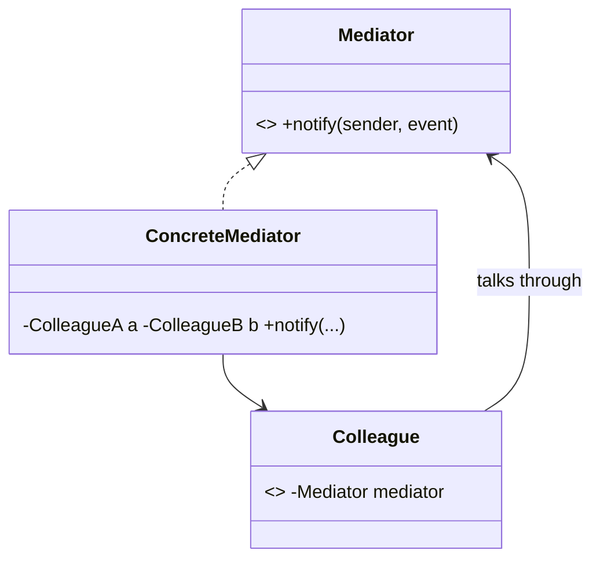

# Mediator Pattern — Concept

## What Is It?

**Mediator** defines an object that **encapsulates how a set of objects interact**. Instead of colleagues referring to each other directly — a tangled many-to-many web — they talk **only through the mediator**, turning the web into a **star**. This reduces coupling and centralises the interaction logic.

---

## When to Use

> **Trigger keywords:** "many-to-many", "coordinate", "central hub", "decouple colleagues", "communication", "chat room", "air traffic control"

| Trigger | Example |
|---------|---------|
| Many objects **interact in complex ways** | Chat room, air traffic control |
| Reduce **dense references** between classes | UI widgets in a dialog |
| Centralise **coordination rules** | Smart-home hub |
| Reusable, **loosely-coupled** components | Event bus / broker |

---

## Structure



- **Mediator** — the coordination interface
- **ConcreteMediator** — knows the colleagues and routes messages
- **Colleague** — holds a reference to the mediator, not to other colleagues

---

## Variants

### 1. Centralised Mediator
One `ConcreteMediator` holds all colleagues and orchestrates (e.g. a dialog).

### 2. Event Bus / Broker
The mediator is a topic-based bus; colleagues publish/subscribe without knowing each other.

### 3. Mediator + Observer
The mediator notifies colleagues via observer-style callbacks.

---

## Visual Walkthrough

```
❌ Without Mediator — n objects, O(n²) links
  A ↔ B, A ↔ C, A ↔ D, B ↔ C, B ↔ D, C ↔ D

✅ With Mediator — star topology, O(n) links
     A   B   C   D
      \  |   |  /
       Mediator (routes everything)
```

A new colleague needs one reference (to the mediator), not n.

---

## Trade-offs vs Related Patterns

| Pattern | Direction | Purpose |
|---------|-----------|---------|
| **Mediator** | colleagues ↔ mediator (two-way) | coordinate many colleagues |
| **Facade** | client → subsystem (one-way) | simplify an API |
| **Observer** | subject → observers (one-way broadcast) | notify on change |

---

## Common Mistakes

1. **Mediator becomes a god object** — it can accumulate all the interaction logic; keep it cohesive.
2. **Confusing with Facade** — Facade is a *one-way simplification*; Mediator is *two-way coordination* among peers.
3. **Confusing with Observer** — Observer broadcasts one-to-many; Mediator arbitrates colleague-to-colleague.
4. **Colleagues still referencing each other** — defeats the whole point; route through the mediator.
5. **Over-centralising** — a mediator for two objects is usually unnecessary.

---

## Related Patterns

- [[../14 - Observer/Concept|Observer]] — a mediator often notifies via observers
- [[../../Structural/10 - Facade/Concept|Facade]] — one-way simplification of a subsystem
- [[Concept|Mediator]] pairs well with a message [[../16 - Command/Concept|Command]] bus

---

#mediator #behavioural #lld #concept