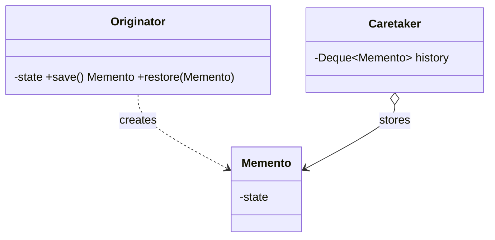

# Memento Pattern — Concept

## What Is It?

**Memento** captures and externalises an object's internal state so it can be **restored later**, **without violating encapsulation**. The object itself produces a snapshot (memento) that only it can read back — clients store snapshots but cannot inspect or tamper with their contents.

---

## When to Use

> **Trigger keywords:** "undo", "redo", "snapshot", "checkpoint", "rollback", "save / restore", "history"

| Trigger | Example |
|---------|---------|
| **Undo / redo** | Text editor, drawing app |
| **Checkpoints** | Save game, transaction savepoint |
| **Rollback on failure** | Multi-step transaction |
| **History** of states | Versioned documents |

---

## Structure



- **Originator** — the object whose state is saved; creates and restores mementos
- **Memento** — an immutable snapshot; opaque to everyone but the originator
- **Caretaker** — stores mementos (history) but never reads them

---

## Variants

### 1. Full snapshot
Copy the entire state (simple, memory-heavy).

### 2. Incremental / delta
Store only the change (token-efficient, more complex).

### 3. Serialised memento
Serialise state to bytes/JSON for persistence.

### 4. Memento + Command
Commands capture a memento before executing so they can undo precisely.

---

## Visual Walkthrough

```
Caretaker: [m0] [m1] [m2]          ← history (opaque snapshots)
Originator state: "abc" → "abcd" → "abcde"

undo() → restore(m1) → state becomes "abcd"
```

The caretaker never looks inside a memento — encapsulation is preserved.

---

## Trade-offs vs Command

| | Command | Memento |
|---|---|---|
| Undo by | reversing the operation | restoring a snapshot |
| Knowledge | knows how to invert | knows nothing (just state) |
| Memory | smaller | larger (full state) |
| Best for | reversible ops | complex/irreversible state |

Often **used together**: a command stores a memento to restore on undo.

---

## Common Mistakes

1. **Exposing the memento's internals** — only the originator should read it; keep fields private and the constructor package-private.
2. **Memory blow-up** — full snapshots of large objects; cap the history or store deltas.
3. **Shallow copies** — a memento holding references to mutable state captures an alias, not a snapshot.
4. **Mutable mementos** — snapshots must be immutable.
5. **Confusing with Command** — Command inverts an operation; Memento restores state.

---

## Related Patterns

- [[../16 - Command/Concept|Command]] — undo via operation reversal; often paired with Memento
- [[../17 - State/Concept|State]] — state transitions that may need rollback
- [[Concept|Memento]] enables [[../16 - Command/Concept|Command]]'s undo reliably

---

#memento #behavioural #lld #concept