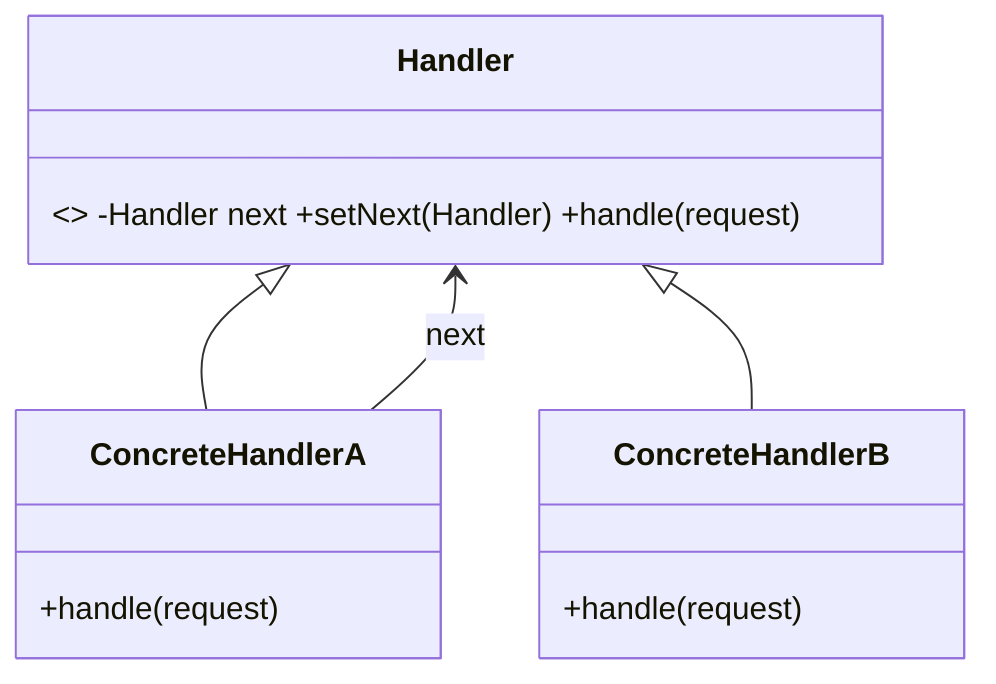

# Chain of Responsibility Pattern — Concept

## What Is It?

**Chain of Responsibility** passes a request along a **chain of handlers** until one of them handles it. The sender is decoupled from the concrete receiver — it just submits to the head of the chain and does not know (or care) which handler ultimately processes the request.

---

## When to Use

> **Trigger keywords:** "pass along", "escalate", "until one handles", "sequence of handlers", "middleware", "approval levels", "filter chain"

| Trigger | Example |
|---------|---------|
| **Multiple handlers** may process a request | Logging levels (DEBUG→INFO→ERROR) |
| **Escalation** until someone can handle it | Support tickets, approvals |
| **Middleware / filters** | Auth → rate-limit → validation → handler |
| **Sequential rules** | Discount approval limits |

---

## Structure



- **Handler** — defines `handle()` and a `next` link
- **ConcreteHandler** — either handles the request or forwards to `next`
- **Client** — builds the chain and submits to the first handler

---

## Variants

### 1. Pure chain
At most one handler processes the request (then stops).

### 2. Impure chain (middleware)
Every handler may process **and** forward (pre/post logic) — e.g. servlet filters.

### 3. Configurable order
Build the chain from a list so order is data-driven.

---

## Visual Walkthrough

```
Request → [AuthHandler] → [RateLimitHandler] → [ValidationHandler] → [OrderHandler]
               │(ok)            │(ok)                │(ok)               handles it
               ▼                ▼                    ▼
            forward          forward              forward
```

Each handler decides: handle, forward, or reject.

---

## Trade-offs vs Decorator

| | Chain of Responsibility | Decorator |
|---|---|---|
| Who handles | **one** (or stops early) | **all** wrap & add |
| Structure | linked `next` | nested wrapper |
| Purpose | find a handler | add behaviour |
| Client role | submits to head | wraps explicitly |

---

## Common Mistakes

1. **Unhandled requests** — always provide a **default/terminal** handler, or document the "no handler" behaviour.
2. **Broken chain** — forgetting to link `next`, so the request dies silently.
3. **Cycles** — a handler chain that loops forever.
4. **Confusing with Decorator** — Decorator *always* wraps and adds; CoR *may stop* at one handler.
5. **Over-long chains** — debugging gets hard; keep chains short and ordered sensibly.

---

## Related Patterns

- [[../../Structural/09 - Decorator/Concept|Decorator]] — wraps all, adds behaviour
- [[../16 - Command/Concept|Command]] — chains often carry commands
- [[Concept|CoR]] is the backbone of middleware pipelines

---

#chain-of-responsibility #behavioural #lld #concept