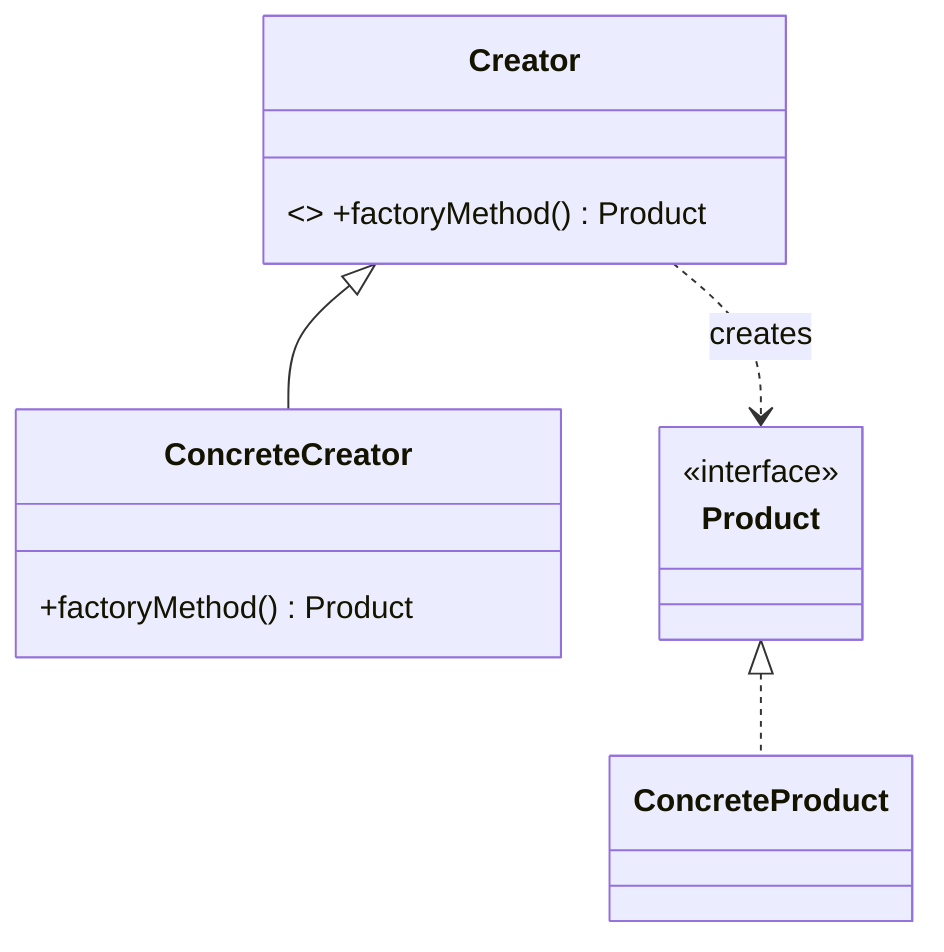

# Factory Method Pattern — Concept

## What Is It?

**Factory Method** defines an interface for **creating an object**, but lets **subclasses decide which concrete class to instantiate**. The client depends only on the *product* interface and the *creator* abstraction — never on concrete classes.

It is the Open/Closed Principle in action: adding a new product type means **adding** a new creator, never **editing** existing code.

---

## When to Use

> **Trigger keywords:** "create", "type of", "without knowing the concrete class", "extensible", "plug-in", "framework hook"

| Trigger | Example |
|---------|---------|
| Creation logic that **varies by type** | `NotificationFactory` → Email / SMS / Push |
| Client must not know **concrete classes** | Payment gateway abstraction |
| A framework offers a **hook** | `Dialog.open()` returns an app-specific doc |
| Objects are created in **many places** | Centralise `new` behind one factory |

---

## Structure



- **Product** — what gets created (interface / abstract class)
- **ConcreteProduct** — the real object
- **Creator** — declares `factoryMethod()`
- **ConcreteCreator** — overrides it to return a specific product

---

## Variants

### 1. Simple Factory (idiomatic — not GoF)
One class with a `switch`/`if` returning products. Easy, but adding a product edits the factory (breaks OCP).

### 2. Factory Method (GoF)
Each product gets its own creator subclass — true OCP, at the cost of more classes.

### 3. Static Factory Method (named constructor)
Convenience method on the class itself: `Money.of(...)`, `Optional.empty()`. Not polymorphic, but great for readability.

---

## Visual Walkthrough

```java
// ❌ Before — client knows every concrete class; adding Stripe edits this method
Payment p;
if (type.equals("CARD"))        p = new CreditCardPayment();
else if (type.equals("UPI"))    p = new UpiPayment();
else if (type.equals("PAYPAL")) p = new PaypalPayment();

// ✅ After — client depends only on the abstraction
Payment p = PaymentFactory.create(PaymentType.valueOf(type));
```

---

## Trade-offs

| Approach | OCP | Classes | Best For |
|----------|-----|---------|----------|
| Simple Factory | ❌ | few | small, stable type sets |
| Factory Method | ✅ | many | frameworks, pluggable products |
| Static Factory Method | ❌ | none | value objects, readability |

---

## Common Mistakes

1. **Returning concrete types** — the factory's return type must be the **interface**.
2. **Vague failures** — throw a clear `IllegalArgumentException("Unknown type: X")`, don't return `null`.
3. **Over-engineering** — a `switch` is fine when the type set is small and stable.
4. **Confusing it with Abstract Factory** — Factory Method creates **one** product; Abstract Factory creates a **family**.
5. **Business logic in the factory** — a factory *creates*; it does not *compute*.

---

## Related Patterns

- [[../03 - Abstract Factory/Concept|Abstract Factory]] — families of related products
- [[../04 - Builder/Concept|Builder]] — step-by-step construction
- [[../01 - Singleton/Concept|Singleton]] — a factory is often shared as a singleton

---

#factory-method #creational #lld #concept