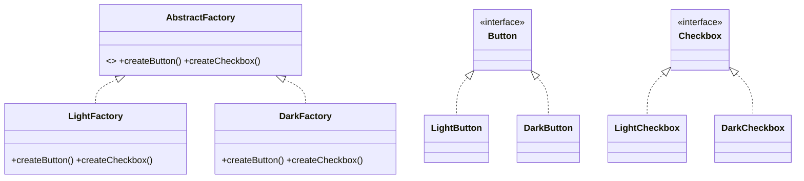

# Abstract Factory Pattern — Concept

## What Is It?

**Abstract Factory** provides an interface for creating **families of related objects** without specifying their concrete classes. Where Factory Method creates **one** product, Abstract Factory guarantees a **consistent set** — the products inside a family always belong together (e.g. a dark-theme button with a dark-theme checkbox).

---

## When to Use

> **Trigger keywords:** "family", "consistent set", "themed", "platform-specific", "suite", "matching"

| Trigger | Example |
|---------|---------|
| Products must come in **matching families** | Light/Dark UI (Button + Checkbox + Scrollbar) |
| **Cross-platform** widgets | Windows / macOS / Linux controls |
| Multiple **backends / vendors** | SQL vs NoSQL repository suite |
| **Cloud provider** SDKs | AWS vs GCP storage + queue + compute |

---

## Structure



- **AbstractFactory** — one `createX()` per product type
- **ConcreteFactory** — builds a whole family (Light / Dark)
- **AbstractProduct** — Button, Checkbox…
- **ConcreteProduct** — Light*, Dark* implementations

---

## Variants

### 1. Classic
A single interface with N `create*()` methods; one concrete factory per family.

### 2. Factory-of-Factories
A registry maps a family key → `AbstractFactory`. Client picks a factory once, then builds the whole family consistently.

### 3. Enum/`switch` factory
A single method switching on a family enum — simpler but less OCP.

---

## Visual Walkthrough

```java
UiFactory f = theme == DARK ? new DarkFactory() : new LightFactory();
Button   b = f.createButton();      // guaranteed to match...
Checkbox c = f.createCheckbox();    // ...the same theme
b.render(); c.render();             // consistent look & feel
```

The client never mixes a dark button with a light checkbox — the factory enforces the family.

---

## Trade-offs

| | Factory Method | Abstract Factory |
|---|---|---|
| Creates | **one** product | a **family** of products |
| Key organising idea | subclass decides product | family/variant decides all products |
| Adding a product | add a creator | **must edit every factory** (OCP pain) |
| Adding a family | N/A | add one factory (easy) |

---

## Common Mistakes

1. **Confusing it with Factory Method** — remember "family vs single product".
2. **Adding a new product type** later — forces a change to the abstract factory and *all* factories; note this trade-off in interviews.
3. **Leaking concrete types** — every `create*()` returns an *abstract* product.
4. **Overuse** — if there is only one product type, plain Factory Method is enough.

---

## Related Patterns

- [[../02 - Factory Method/Concept|Factory Method]] — the single-product cousin
- [[../04 - Builder/Concept|Builder]] — step-by-step construction of one object
- [[../../Structural/06 - Adapter/Concept|Adapter]] — often combined for platform SDKs

---

#abstract-factory #creational #lld #concept