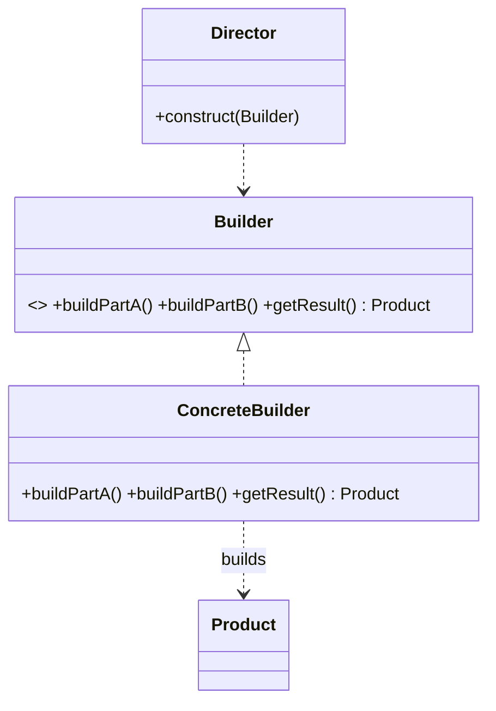

# Builder Pattern — Concept

## What Is It?

**Builder** constructs a **complex object step by step**, separating *construction* from *representation*. It replaces **telescoping constructors** (a constructor with 8 parameters) and unreadable setter chains with a fluent, self-documenting API — and it lets you build an **immutable** object safely.

---

## When to Use

> **Trigger keywords:** "many optional parameters", "fluent", "step by step", "complex object", "immutable", "configure", "telescoping constructor"

| Trigger | Example |
|---------|---------|
| An object has **many optional fields** | `HttpRequest` (headers, body, timeout, retries) |
| You need an **immutable** object with lots of state | `Pizza`, `User` |
| Construction follows **required steps** | `SqlQuery` (SELECT → FROM → WHERE) |
| Same steps, **different representations** | HTML document vs Markdown document |

---

## Structure



In modern Java the **Director is usually dropped**, and the builder becomes a **static nested class** of the product with a fluent API and a validating `build()`.

---

## Variants

### 1. Classic GoF (Director + Builder)
A `Director` encodes a reusable construction sequence; builders vary the representation.

### 2. Fluent Nested Builder (most common in Java)
```java
HttpRequest req = HttpRequest.builder()
        .url("https://api.example.com")
        .method("POST")
        .header("Content-Type", "application/json")
        .timeout(5)
        .build();
```

### 3. Lombok `@Builder`
Generates the boilerplate at compile time (`@Builder` on the class).

---

## Visual Walkthrough

```java
// ❌ Telescoping constructor — which "true" is which?
new Pizza("LARGE", true, false, true, true, false, "extra cheese");

// ✅ Builder — readable, order-free, validation lives in build()
Pizza p = Pizza.builder()
        .size("LARGE")
        .cheese(true)
        .pepperoni(true)
        .extraCheese("extra cheese")
        .build();
```

---

## Trade-offs

| | Constructor | Setters | Builder |
|---|---|---|---|
| Readability (many fields) | ❌ | ❌ | ✅ |
| Immutability | ✅ | ❌ | ✅ |
| Validation before use | ✅ | ❌ | ✅ (in `build()`) |
| Boilerplate | low | low | higher |

---

## Common Mistakes

1. **No validation in `build()`** — validate required fields and invariants there.
2. **Producing a mutable object** — the built object should be immutable (`final` fields, no setters).
3. **Reusing a builder instance** — state leaks between builds; create a fresh builder each time.
4. **Overuse** — a 2-field object does not need a builder.
5. **Naming confusion** — the fluent method should return `this` (the builder), not the product.

---

## Related Patterns

- [[../02 - Factory Method/Concept|Factory Method]] — one-shot creation vs step-by-step
- [[../05 - Prototype/Concept|Prototype]] — clone instead of build
- [[../../Structural/08 - Composite/Concept|Composite]] — builders often construct trees

---

#builder #creational #lld #concept