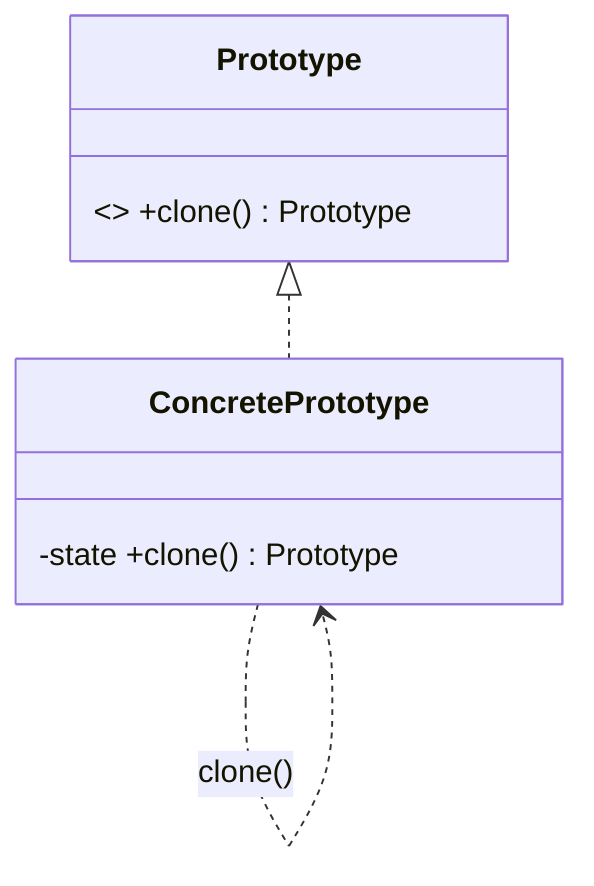

# Prototype Pattern — Concept

## What Is It?

**Prototype** creates new objects by **cloning** an existing instance (the *prototype*) instead of calling a constructor. It shines when creation is **expensive** (DB / file / network), when the concrete class is chosen at runtime, or when you need **many slightly-different copies** of a complex object.

---

## When to Use

> **Trigger keywords:** "clone", "copy", "template", "expensive to create", "many similar objects", "snapshot"

| Trigger | Example |
|---------|---------|
| Creation is **costly** | Object loaded from DB / parsed from file |
| **Many similar variants** | Game enemies differing in a few fields |
| Class decided **at runtime** | Configure one instance, then clone it |
| Need a **snapshot / undo** | Memento-style state capture |

---

## Structure



- **Prototype** — declares `clone()`
- **ConcretePrototype** — returns a copy of itself
- Optionally a **PrototypeRegistry** — `Map<String, Prototype>` of pre-built templates

---

## Variants

### 1. Shallow Copy
Copies field values; **objects are shared** (same references).
```java
class Point { int x, y; Point copy() { return new Point(x, y); } }  // primitives → safe
```

### 2. Deep Copy
Recursively clones nested mutable objects — required whenever the prototype holds collections/mutable fields.
```java
class Order { List<Item> items; Order copy() { return new Order(new ArrayList<>(items)); } }
```

### 3. Copy Constructor
An alternative to `Cloneable`: `new Pizza(otherPizza)`.

### 4. Prototype Registry
Pre-build a set of templates and copy them on demand by key.

---

## Visual Walkthrough

```
Prototype (loaded from DB)  ──clone()──►  Copy 1 (tweak 1 field)
                            ──clone()──►  Copy 2 (tweak another field)
                            ──clone()──►  Copy 3
   ▲ one expensive build                       ▲ many cheap copies
```

---

## Trade-offs

| Copy type | Speed | Safety with mutable state |
|-----------|-------|---------------------------|
| Shallow | Fast | ❌ shares references |
| Deep | Slower | ✅ fully independent |

---

## Common Mistakes

1. **Shallow copy sharing mutable state** — the classic bug; clone collections and nested objects.
2. **`Cloneable` is broken** — it does not declare `clone()`, and `Object.clone()` bypasses constructors (invariants not enforced).
3. **Forgetting deep copy for collections** — `new ArrayList<>(other)` for lists, maps, and arrays.
4. **Circular references** — naïve deep copy can loop forever; track visited objects.
5. **Overuse** — for cheap objects a plain constructor is simpler.

---

## Related Patterns

- [[../04 - Builder/Concept|Builder]] — build from scratch vs clone a template
- [[../03 - Abstract Factory/Concept|Abstract Factory]] — prototypes can *be* the factories
- [[../../Behavioural/21 - Memento/Concept|Memento]] — snapshots of object state

---

#prototype #creational #lld #concept