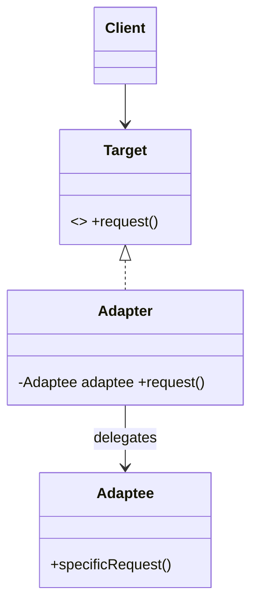

# Adapter Pattern — Concept

## What Is It?

**Adapter** converts the interface of a class into another interface the client expects. It lets **incompatible** classes collaborate — think of a travel power plug. It is a *retrofit* pattern: you reach for it when you must reuse something whose interface does not match.

---

## When to Use

> **Trigger keywords:** "incompatible", "legacy", "third-party", "wrapper", "convert interface", "integrate", "doesn't match"

| Trigger | Example |
|---------|---------|
| Integrating a **3rd-party / legacy API** | `StripeApi.charge()` behind your `PaymentGateway` |
| A class has the **right data, wrong methods** | XML library where you need JSON |
| Reuse a class whose **interface is unsuitable** | Old `Logger` behind a new `AppLogger` |
| **Isolate** vendor types from your core | Prevent SDK leakage into domain code |

---

## Structure



**Two flavours**
- **Object Adapter** (preferred): the adapter **holds** an adaptee and delegates (composition).
- **Class Adapter**: the adapter **extends** the adaptee (needs multiple inheritance — not possible in Java without an interface).

---

## Variants

### 1. Object Adapter (composition)
```java
class StripeAdapter implements PaymentGateway {
    private final StripeApi stripe;                 // adaptee
    public void pay(double amount) { stripe.charge(amount, "USD"); }
}
```

### 2. Class Adapter (inheritance)
```java
class LegacyAdapter extends LegacyLogger implements AppLogger { /* ... */ }
```

### 3. Two-way Adapter
Implements both interfaces so either side can call the other.

---

## Visual Walkthrough

```
Client ──► Target.pay(100)
                │ (interface expected)
                ▼
           Adapter.pay(100)  ──►  Adaptee.charge(100, "USD")
                                      (different method + extra arg)
```

---

## Trade-offs

| | Object Adapter | Class Adapter |
|---|---|---|
| Mechanism | composition | inheritance |
| Java-friendly | ✅ | ⚠️ (single class) |
| Works with subclasses of adaptee | ❌ (exact type) | ✅ |
| Preferred | ✅ | rare |

---

## Common Mistakes

1. **Confusing Adapter with Decorator** — Adapter *changes* the interface; Decorator *adds behaviour* while keeping the interface.
2. **Confusing Adapter with Facade** — Facade *simplifies* a whole subsystem; Adapter *converts one* interface.
3. **Business logic in the adapter** — it should only translate calls and data.
4. **Leaking the adaptee type** — never return/accept the adaptee in the Target interface.
5. **Unnecessary adapter** — if you control both interfaces, just align them.

---

## Related Patterns

- [[../09 - Decorator/Concept|Decorator]] — same-shape wrapper that adds behaviour
- [[../10 - Facade/Concept|Facade]] — a simplified front over a subsystem
- [[../12 - Proxy/Concept|Proxy]] — same interface, controls access

---

#adapter #structural #lld #concept