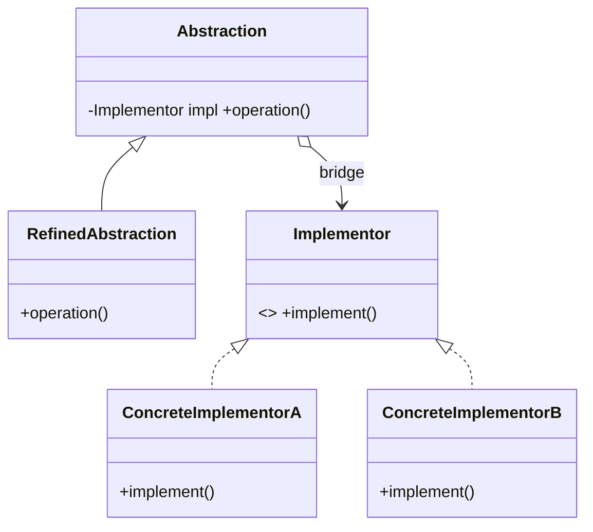

# Bridge Pattern — Concept

## What Is It?

**Bridge** decouples an **abstraction** from its **implementation** so both can vary independently. Instead of building a class for every combination (which explodes into a cartesian product), you build **two orthogonal hierarchies** and connect them with a *bridge* (a reference held by composition).

---

## When to Use

> **Trigger keywords:** "two dimensions", "vary independently", "both can change", "avoid class explosion", "platform + type", "and + and"

| Trigger | Dimensions | Example |
|---------|-----------|---------|
| Two independent axes of variation | Shape × Renderer | Vector / Raster rendering |
| Platform + feature | Remote × Device | TV / Radio |
| Type + format | Report × Format | PDF / HTML / CSV |
| Channel + message | Message × Sender | Email / SMS / Push |

---

## Structure



- **Abstraction** — high-level control, holds an **Implementor**
- **RefinedAbstraction** — extends the abstraction
- **Implementor** — the low-level interface
- **ConcreteImplementor** — the actual platform/variant

---

## Variants

### 1. Classic Bridge
Two hierarchies: `Shape` × `Renderer`.

### 2. Bridge via dependency injection
Inject the *implementor* into the abstraction's constructor — same idea, modern wiring.

---

## Visual Walkthrough

```
❌ Without Bridge — class explosion (3 shapes × 3 renderers = 9 classes)
RedCircle-Vector, RedCircle-Raster, BlueCircle-Vector, …

✅ With Bridge — 3 + 3 = 6 classes
Shape (Circle, Square, Triangle)  ──bridge──►  Renderer (Vector, Raster)
```

---

## Trade-offs vs Strategy / Adapter

| Pattern | Intent | Same shape? |
|---------|--------|-------------|
| **Bridge** | separate two hierarchies, both vary | yes (composition) |
| **Strategy** | swap one interchangeable algorithm | yes |
| **Adapter** | retrofit an incompatible interface | no |

**Bridge** is designed **up front** for two axes; **Strategy** selects an algorithm at runtime; **Adapter** fixes a mismatch after the fact.

---

## Common Mistakes

1. **Confusing Bridge with Strategy** — same structure, different *intent*; say "two dimensions vs one swappable algorithm".
2. **Missing the second dimension** — if there is only one axis, it is Strategy, not Bridge.
3. **Over-abstraction** — don't bridge when a simple composition suffices.
4. **Naming** — call the low level `Implementor`/`Renderer`, not `Implementation`.

---

## Related Patterns

- [[../../Behavioural/15 - Strategy/Concept|Strategy]] — one swappable algorithm
- [[../06 - Adapter/Concept|Adapter]] — convert an incompatible interface
- [[../../Creational/03 - Abstract Factory/Concept|Abstract Factory]] — can create the bridged family

---

#bridge #structural #lld #concept