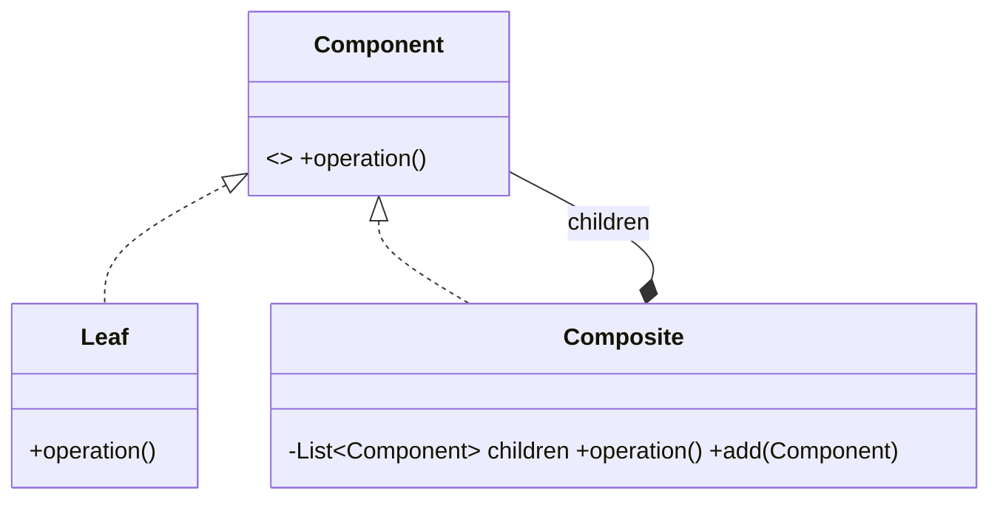

# Composite Pattern — Concept

## What Is It?

**Composite** composes objects into **tree structures** and lets the client treat **individual objects** (leaves) and **compositions** (branches) **uniformly**. Whether you call an operation on one leaf or an entire subtree, you use the same method.

---

## When to Use

> **Trigger keywords:** "tree", "part-whole", "hierarchy", "nested", "folder/file", "group of items", "recursive structure"

| Trigger | Example |
|---------|---------|
| A **part–whole hierarchy** | Folder contains Files and Folders |
| **Uniform treatment** of leaf and group | Menu with sub-menus |
| Operations that **recurse naturally** | Total size, total price, depth |
| **Org / UI trees** | Manager → reports |

---

## Structure



- **Component** — the common interface for leaves and composites
- **Leaf** — an individual element (no children)
- **Composite** — holds children and delegates/aggregates over them

---

## Variants

### 1. Transparent
Child-management methods (`add`, `remove`) live on **Component** — uniform API, but leaves must throw or ignore them.

### 2. Safe (recommended)
Child-management lives **only on Composite** — type-safe, but clients may need an `instanceof` check.

---

## Visual Walkthrough

```
          📁 root
         /   |    \
      📁 docs 📄 a.txt 📁 media
        /  \              |
   📄 b   📁 sub       📄 video.mp4

root.size() = docs.size() + a.size() + media.size()
            = (b + sub)     + a        + video
```

One `size()` call aggregates the whole tree by recursion.

---

## Trade-offs

| | Transparent | Safe |
|---|---|---|
| Uniform API | ✅ | ⚠️ (cast) |
| Type safety | ❌ (leaf throws) | ✅ |
| Simplicity | simpler client | safer model |

---

## Common Mistakes

1. **Confusing Composite with Decorator** — Composite holds **many** children (a tree); Decorator wraps **one** component to add behaviour.
2. **Leaf throwing `UnsupportedOperationException`** — a symptom of the transparent variant; prefer the safe variant.
3. **Forgetting recursion** — aggregates must sum over children, not just self.
4. **Allowing cycles** — a node that eventually contains itself breaks traversal.
5. **Shared mutable children** — careful when the same leaf is added to two parents.

---

## Related Patterns

- [[../09 - Decorator/Concept|Decorator]] — one-child wrapper that adds behaviour
- [[../../Behavioural/13 - Iterator/Concept|Iterator]] — traverse a composite uniformly
- [[../../Behavioural/19 - Visitor/Concept|Visitor]] — run operations over a composite tree

---

#composite #structural #lld #concept