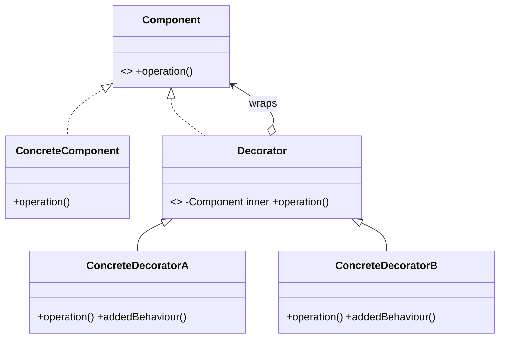

# Decorator Pattern — Concept

## What Is It?

**Decorator** attaches **additional responsibilities** to an object **dynamically** by **wrapping** it. The wrapper implements the **same interface** as the object it wraps, so decorated and undecorated objects remain interchangeable — and you can **stack** decorators to compose behaviour.

---

## When to Use

> **Trigger keywords:** "add behaviour", "optional features", "wrap", "extend dynamically", "stack features", "without subclassing", "toppings/condiments"

| Trigger | Example |
|---------|---------|
| **Optional features** combined freely | Coffee + milk + mocha + whip |
| Cannot use inheritance (**class explosion**) | 2^n subclasses for n features |
| **Add behaviour at runtime** | Wrap a `Reader` with buffering |
| **Stackable** responsibilities | HTTP middleware (auth, logging, retry) |

---

## Structure



- **Component** — the common interface
- **ConcreteComponent** — the object being decorated
- **Decorator** — holds a Component and forwards calls
- **ConcreteDecorator** — adds behaviour before/after delegating

---

## Variants

### 1. Classic Decorator
Each decorator adds cost/description: `Milk(Mocha(Espresso()))`.

### 2. Java I/O (the canonical example)
```java
var in = new BufferedReader(new InputStreamReader(new FileInputStream("f.txt")));
//           buffering            char decoding            raw bytes
```

### 3. Middleware chains
Auth, logging, and retry handlers wrapped around a base handler.

---

## Visual Walkthrough

```
whip(mocha(milk(espresso)))
   ▲      ▲     ▲      ▲
 cost: 0.6 + 0.75 + 0.5 + 2.0 = 3.85
 desc: "Espresso, Milk, Mocha, Whip"
```

Each layer adds to the previous result — order matters.

---

## Trade-offs vs Inheritance

| | Inheritance | Decorator |
|---|---|---|
| Combination explosion | 2^n subclasses | n decorators |
| Runtime composition | ❌ static | ✅ dynamic |
| Order sensitivity | N/A | ✅ matters |
| Debuggability | easy | deep stacks are harder |

---

## Common Mistakes

1. **Confusing with Proxy** — Proxy *controls access* (same interface, often 1:1, may skip the call); Decorator *adds behaviour*.
2. **Confusing with Adapter** — Adapter *changes the interface*; Decorator keeps it.
3. **Changing the interface** — a decorator that exposes new methods breaks interchangeability.
4. **Decorator order** — document whether order matters (it usually does).
5. **Long wrapper stacks** — hard to debug; keep decorators small and single-purpose.

---

## Related Patterns

- [[../12 - Proxy/Concept|Proxy]] — same interface, controls access
- [[../06 - Adapter/Concept|Adapter]] — changes the interface
- [[../08 - Composite/Concept|Composite]] — a tree of components vs a single wrapped component

---

#decorator #structural #lld #concept