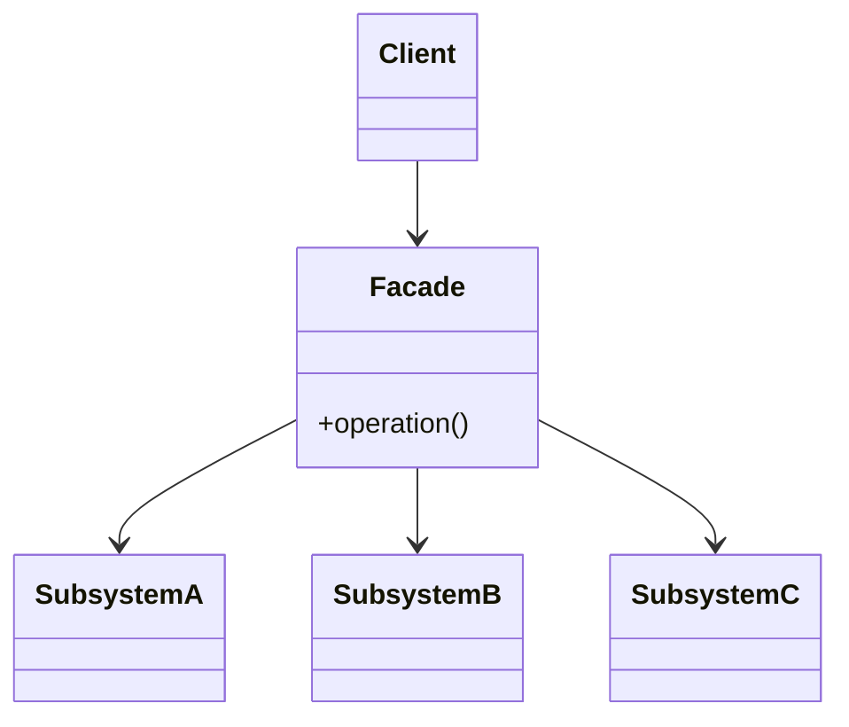

# Facade Pattern — Concept

## What Is It?

**Facade** provides a **unified, simplified interface** to a set of interfaces in a subsystem. It hides complexity behind one convenient entry point, so callers don't need to orchestrate many low-level classes — while the underlying subsystem remains fully usable directly.

---

## When to Use

> **Trigger keywords:** "simplify", "one entry point", "hide complexity", "subsystem", "workflow", "high-level API", "one method to do everything"

| Trigger | Example |
|---------|---------|
| A workflow needs **several subsystems** | Checkout = cart + payment + inventory + shipping + notify |
| Reduce **coupling** to many classes | `HomeTheaterFacade.watchMovie()` |
| Provide a **layered / clean API** | Library `initialize()` hides setup |
| One-shot **high-level operation** | `ComputerFacade.start()` |

---

## Structure



- **Facade** — a single class exposing a small, coarse-grained API
- **Subsystem classes** — unchanged; still callable directly if needed

---

## Variants

### 1. Simple facade
One class that composes several calls: `watchMovie()` → projector.on(), amp.on(), dvd.play().

### 2. Facade over a workflow
A service that orchestrates an end-to-end use case (`CheckoutFacade.checkout(...)`).

### 3. Layered facade
Facades per layer, chaining (presentation → application → domain).

---

## Visual Walkthrough

```
Without Facade — the client must know the whole recipe:
  inventory.reserve(items); payment.charge(card);
  shipping.schedule(addr); notification.send(user); orderRepo.save(order);

With Facade — one call:
  checkoutFacade.checkout(cart, card, addr);   // orchestrates all of the above
```

---

## Trade-offs vs Related Patterns

| Pattern | Intent |
|---------|--------|
| **Facade** | simplify a whole **subsystem** (N → 1) |
| **Adapter** | convert **one** interface to another (1 → 1) |
| **Mediator** | colleagues talk *through* a hub, both directions |
| **Decorator** | add behaviour, same interface |

---

## Common Mistakes

1. **Facade becomes a god class** — keep it thin; delegate, don't accumulate logic.
2. **Adding business rules** in the facade instead of the subsystem.
3. **Hiding everything** — keep subsystem classes accessible for advanced callers.
4. **Confusing with Adapter** — a facade is *simpler*; an adapter is *different*.
5. **Making the facade a Singleton by default** — only if it must be shared.

---

## Related Patterns

- [[../06 - Adapter/Concept|Adapter]] — interface conversion (1:1)
- [[../../Behavioural/20 - Mediator/Concept|Mediator]] — bidirectional coordination between colleagues
- [[Concept|Facade]] itself is often the **entry point** to a layered design

---

#facade #structural #lld #concept