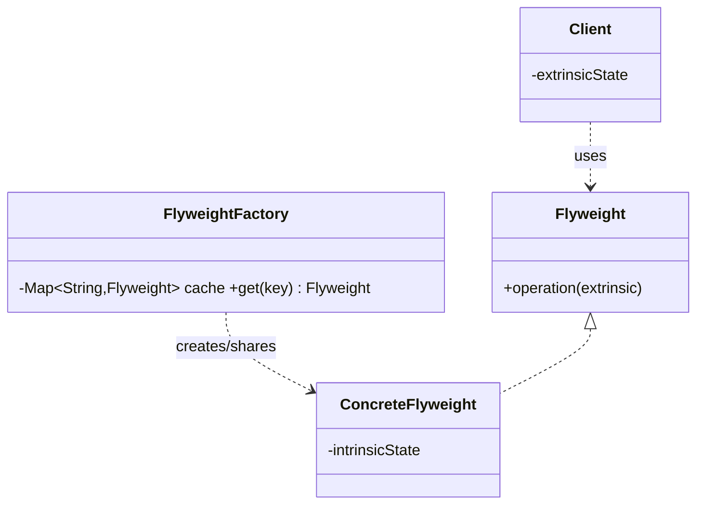

# Flyweight Pattern — Concept

## What Is It?

**Flyweight** reduces memory usage by **sharing** the common, immutable portion of an object's state (**intrinsic** state) among many objects, while the varying portion (**extrinsic** state) is supplied from outside. It lets you support a **huge number** of fine-grained objects cheaply.

---

## When to Use

> **Trigger keywords:** "millions of objects", "memory", "share", "many identical", "cache", "intrinsic / extrinsic", "text characters", "particles"

| Trigger | Example |
|---------|---------|
| **Very many objects** that share data | 1M trees, all Oak or Pine |
| Shared state is **immutable** | Font / colour / texture |
| Per-object state is **small** | x, y position |
| Objects are **interchangeable** by type | Chess pieces, bullets |

---

## Structure



- **Flyweight** — operation taking extrinsic state
- **ConcreteFlyweight** — stores intrinsic state (immutable)
- **FlyweightFactory** — caches and returns shared flyweights
- **Client** — holds extrinsic state and passes it in

---

## Variants

### 1. Factory-keyed sharing (classic)
`FlyweightFactory.get(name)` returns a cached shared instance.

### 2. Built-in flyweights in the JDK
- `Integer.valueOf(1..127)` — the Integer cache
- **String pool** — interned literals

### 3. Immutable value objects
Records used as shared, hashable flyweights.

---

## Visual Walkthrough

```
🌲 1,000,000 trees in a forest
   each tree = { x, y, TreeType }        ← extrinsic = x, y
   TreeType  = { name, color, texture }  ← intrinsic, SHARED

Without Flyweight : 1,000,000 TreeType objects
With  Flyweight   : 2 TreeType objects (Oak, Pine) + 1,000,000 tiny Tree refs
```

---

## Trade-offs

| | Without Flyweight | With Flyweight |
|---|---|---|
| Memory | huge | small |
| Complexity | low | higher (factory + key) |
| State safety | simple | intrinsic must be **immutable** |

---

## Common Mistakes

1. **Confusing intrinsic vs extrinsic** — intrinsic is *shared & constant*; extrinsic is *per-object*.
2. **Mutating shared state** — a shared flyweight MUST be immutable, or all users see the change.
3. **Forgetting the factory** — without caching you gain nothing.
4. **Overuse** — if object counts are small, the added complexity is not worth it.
5. **Passing intrinsic state on every call** — it belongs in the flyweight, not the call.

---

## Related Patterns

- [[../../Creational/01 - Singleton/Concept|Singleton]] — one instance of a *type* vs one shared *per key*
- [[../10 - Facade/Concept|Facade]] — FlyweightFactory is a cache facade
- [[../12 - Proxy/Concept|Proxy]] — a caching proxy is a related idea

---

#flyweight #structural #lld #concept