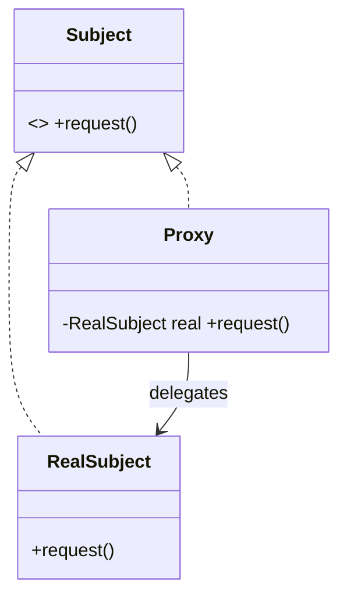

# Proxy Pattern — Concept

## What Is It?

**Proxy** provides a **surrogate or placeholder** for another object to **control access** to it. The proxy implements the **same interface** as the real subject, so clients cannot tell them apart — but the proxy can add lazy loading, access checks, caching, or logging around the real call.

---

## When to Use

> **Trigger keywords:** "lazy", "control access", "cache", "remote", "security", "virtual", "logging", "reference counting", "on behalf of"

| Proxy type | Purpose | Example |
|-----------|---------|---------|
| **Virtual** | defer expensive creation | Load a big image on first `display()` |
| **Protection** | enforce permissions | Only ADMIN may `withdraw()` |
| **Remote** | local stand-in for a remote object | RPC client stub |
| **Caching** | memoize results | Cache `get(key)` |
| **Logging / Auditing** | record calls | Log every service method |
| **Smart reference** | ref-counting / locking | Auto-close resources |

---

## Structure



- **Subject** — the common interface
- **RealSubject** — the real object doing the work
- **Proxy** — same interface, controls access, usually delegates

---

## Variants

### 1. Static Proxy
Hand-written class implementing the same interface.

### 2. Dynamic Proxy (JDK)
`java.lang.reflect.Proxy` generates a proxy at runtime from an interface — the basis of **Spring AOP** for `@Transactional`, `@Cacheable`, security.

### 3. CGLIB / bytecode proxies
Subclass-based proxies for classes without interfaces.

---

## Visual Walkthrough

```
Virtual Proxy (lazy load):
  client.display() ─► Proxy.display()
                        │ real == null ? create RealImage (expensive) : reuse
                        ▼
                     RealImage.display()
```

The expensive object is only created when first needed.

---

## Trade-offs vs Related Patterns

| Pattern | Same interface? | Intent |
|---------|-----------------|--------|
| **Proxy** | ✅ | **control access** to the real object |
| **Decorator** | ✅ | **add behaviour** (client controls wrapping) |
| **Adapter** | ❌ (different) | **convert** an interface |

Proxy usually owns/creates its subject and may **not** delegate at all (e.g. access denied).

---

## Common Mistakes

1. **Confusing Proxy with Decorator** — Decorator is given the wrapped object and adds behaviour; Proxy typically *controls* access and may create the real subject.
2. **Confusing Proxy with Adapter** — Adapter *changes* the interface; Proxy keeps it.
3. **Silently changing semantics** — a proxy should honour the Subject contract.
4. **Forgetting thread safety** in lazy-init proxies — guard double initialisation.
5. **Over-abstracting** — don't proxy when direct use is fine.

---

## Related Patterns

- [[../09 - Decorator/Concept|Decorator]] — same interface, adds behaviour
- [[../06 - Adapter/Concept|Adapter]] — changes the interface
- [[../11 - Flyweight/Concept|Flyweight]] — a caching proxy resembles a factory cache

---

#proxy #structural #lld #concept