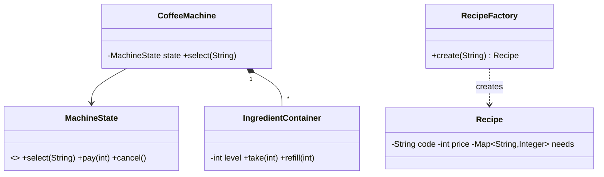

# Design Coffee Vending Machine — Concept

## What Is It?

A machine brewing **coffee recipes** (espresso / latte / cappuccino) from **ingredient containers** (water, milk, beans), taking payment and dispensing cups. The Factory + State Easy problem — recipes are products, ingredients are the bounded ledger.

| | |
|---|---|
| **Difficulty** | Easy |
| **Patterns** | Factory, State |
| **Core** | recipe factory + ingredient check → brew → dispense; refill as operator flow |

---

## Requirements

**Functional**
- Offer **recipes** with ingredient lists + price; **select** only if ingredients suffice and payment covers price.
- **Brew** deducts ingredients atomically, then **dispenses**; **cancel** refunds.
- Operator **refills** ingredient containers; machine reports **low-ingredient** state.

**Non-functional**
- New recipes plug in via the factory — no brewer changes.
- Partial brews must be impossible — check-then-deduct is atomic.

---

## Core Entities

| Entity | Responsibility |
|--------|----------------|
| `CoffeeMachine` (context) | State, containers, cash; delegates to current state |
| `Recipe` (product) | Name, price, ingredient map |
| `RecipeFactory` | Registers/creates recipes by code |
| `IngredientContainer` | One ingredient + level; dispense/refill |
| `BrewState` machine | Idle → Selection → Payment → Brewing → Dispense |

---

## Class Diagram

---

## Related

- [[../00 - Index|Easy Problems Index]]
- [[../../00 - Index|LLD Problems Index]]
- [[../../../00 - Index|LLD Main Index]]
- [[../Design-Vending-Machine/Concept|Vending Machine]] · [[../../../Patterns/Creational/02 - Factory Method/Concept|Factory Method]] · [[../../../Patterns/Behavioural/17 - State/Concept|State]]

---

#lld #machine-coding #coffee-machine #easy #concept
