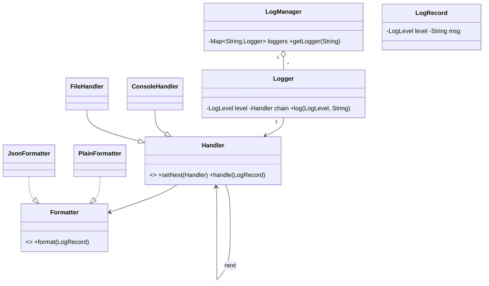

# Design Logging Framework — Concept

## What Is It?

An in-process logging library where **loggers** emit **records** (level + message + timestamp) through **handlers** (console / file / network) with **formatters** and **filters**. The Chain-of-Responsibility Easy problem — levels gate, handlers fan out, all behind a Singleton facade.

| | |
|---|---|
| **Difficulty** | Easy |
| **Patterns** | Singleton, Chain of Responsibility |
| **Core** | Logger → level check → handlers → formatter → sink |

---

## Requirements

**Functional**
- Log at levels **DEBUG < INFO < WARN < ERROR < FATAL**; per-logger level gates output.
- Route to multiple **handlers**: console, file, network; each handler has its own level + formatter.
- Support **formatters** (plain, JSON) and **filters** (e.g. by module); loggers form a **hierarchy** (root → module).

**Non-functional**
- Logging must never break the app — handler failures are swallowed/retried, never thrown.
- Adding a handler/formatter needs no logger changes — chain + strategy.

---

## Core Entities

| Entity | Responsibility |
|--------|----------------|
| `LogManager` (Singleton) | Owns logger registry + root configuration |
| `Logger` | Named logger; level check, then forwards to handlers |
| `LogRecord` | Level + message + timestamp + logger name + thread |
| `Handler` (chain) | Level gate → filter → format → emit; `setNext` chains |
| `Formatter` (Strategy) | Renders a record (plain / JSON) |
| `Filter` | Drops records (e.g. module allow-list) |

---

## Class Diagram

---

## Related

- [[../00 - Index|Easy Problems Index]]
- [[../../00 - Index|LLD Problems Index]]
- [[../../../00 - Index|LLD Main Index]]
- [[../../../Patterns/Creational/01 - Singleton/Concept|Singleton]] · [[../../../Patterns/Behavioural/22 - Chain of Responsibility/Concept|Chain of Responsibility]] · [[../../../Patterns/Behavioural/15 - Strategy/Concept|Strategy]]

---

#lld #machine-coding #logging #easy #concept
