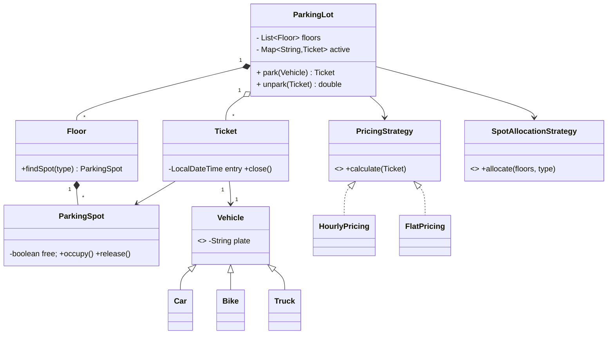

# Design Parking Lot — Concept

## What Is It?

A multi-floor parking lot where **vehicles** park in compatible **spots**, a **ticket** is issued on entry, and a **fee** is computed on exit. The classic Easy LLD problem — tests OOP modelling, Strategy (pricing/allocation), and Singleton (facade).

| | |
|---|---|
| **Difficulty** | Easy |
| **Patterns** | Singleton, Factory, Strategy |
| **Core** | floors → spots, ticket lifecycle, pluggable pricing |

---

## Requirements

**Functional**
- A lot has multiple **floors**, each with **parking spots** of different **types** (bike / car / truck).
- A **vehicle** can be parked if a compatible spot is free; a **ticket** is issued on entry.
- On exit, a **fee** is computed from duration + vehicle type and the spot is released.

**Non-functional**
- Pluggable **pricing** (hourly, flat, peak) and **spot-allocation** strategies.
- Multi-threaded entry/exit must not double-book a spot.

---

## Core Entities

| Entity | Responsibility |
|--------|----------------|
| `ParkingLot` (Singleton) | Top-level facade; holds floors + active tickets |
| `Floor` | Manages a set of spots on one level |
| `ParkingSpot` | A single slot; knows type + occupancy |
| `Vehicle` (abstract) | License plate + `VehicleType` |
| `Ticket` | Entry/exit time, vehicle, assigned spot |
| `PricingStrategy` | Computes fee |
| `SpotAllocationStrategy` | Finds a compatible free spot |

---

## Class Diagram

---

## Related

- [[../00 - Index|Easy Problems Index]]
- [[../../00 - Index|LLD Problems Index]]
- [[../../../00 - Index|LLD Main Index]]
- [[../../../Patterns/Behavioural/15 - Strategy/Concept|Strategy]] · [[../../../Patterns/Creational/01 - Singleton/Concept|Singleton]] · [[../../../UML/01 - Class Diagram/Concept|Class Diagram]]

---

#lld #machine-coding #parking-lot #easy #concept
