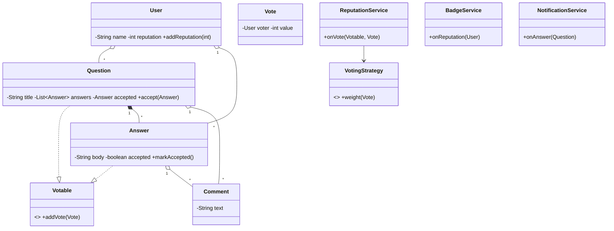

# Design Stack Overflow — Concept

## What Is It?

A Q&A forum where **users** post **questions**, others post **answers**, and the community **votes** and **comments**. The Observer-heavy Easy problem — reputation, badges, and notifications all react to voting events.

| | |
|---|---|
| **Difficulty** | Easy |
| **Patterns** | Observer, Strategy |
| **Core** | question → answers → votes/comments; reputation derived, never stored |

---

## Requirements

**Functional**
- Users post **questions** with title, body, and **tags**; questions can be closed or marked answered.
- Users post **answers** to open questions; one answer can be **accepted**.
- Users **vote** (+1 / −1) on questions and answers; users **comment** on both.
- **Reputation** changes on upvote/downvote/accept; **badges** awarded at thresholds; **notifications** on answers, comments, and accepts.

**Non-functional**
- Voting rules (weights, limits) must be pluggable — a `VotingStrategy`.
- Vote → reputation → badge → notification must fan out without coupling voters to badges.

---

## Core Entities

| Entity | Responsibility |
|--------|----------------|
| `User` | Posts, votes, accumulates reputation + badges |
| `Question` | Title, body, tags, answers, votes, comments, accepted answer |
| `Answer` | Body, votes, comments, accepted flag |
| `Comment` | Text on a question or answer |
| `Vote` | Voter + value (+1 / −1) |
| `VotingStrategy` | Reputation weight per vote type |
| `ReputationService` (Observer) | Reacts to vote/accept events, updates reputation |
| `BadgeService` (Observer) | Reacts to reputation changes, awards badges |
| `NotificationService` (Observer) | Reacts to answers/comments/accepts |

---

## Class Diagram

---

## Related

- [[../00 - Index|Easy Problems Index]]
- [[../../00 - Index|LLD Problems Index]]
- [[../../../00 - Index|LLD Main Index]]
- [[../../../Patterns/Behavioural/14 - Observer/Concept|Observer]] · [[../../../Patterns/Behavioural/15 - Strategy/Concept|Strategy]]

---

#lld #machine-coding #stack-overflow #easy #concept
