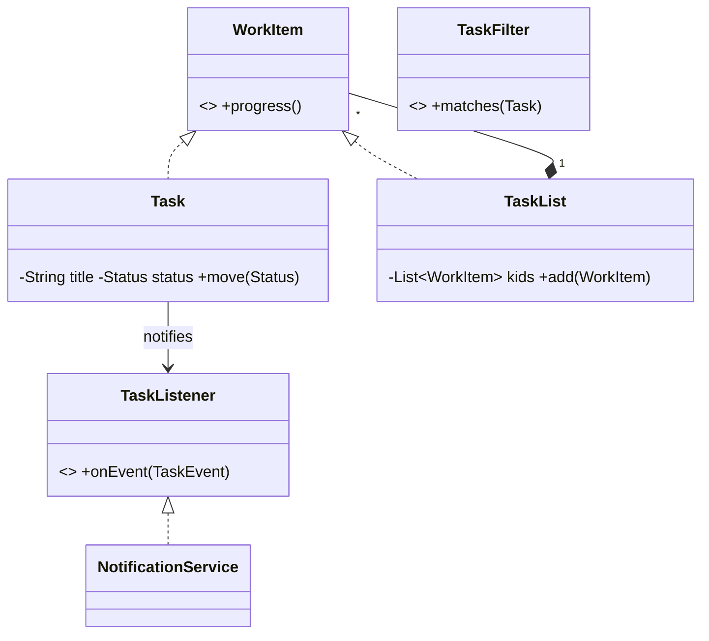

# Design a Task Management System — Concept

## What Is It?

A Kanban-style tracker where **users** create **tasks** (title, description, priority, due date), organise them in **task lists** (To Do / In Progress / Done), **assign** them, and get **notified** on changes. The Composite + Observer Easy problem — lists nest, events fan out.

| | |
|---|---|
| **Difficulty** | Easy |
| **Patterns** | Composite, Observer |
| **Core** | task ⇄ list tree; assign/move/comment events → notifications |

---

## Requirements

**Functional**
- Create **tasks** with title, description, priority, due date, assignee, status, comments.
- Organise in **task lists**; lists nest (project → sprint → list); move tasks across lists.
- **Assign / reassign**; **filter** by assignee, priority, due date, status.
- **Notify** assignee + watchers on assign, move, comment, due-date approach.

**Non-functional**
- Uniform treat-single-task-and-list — Composite: progress rolls up.
- New event types plug in as observers — no task changes.

---

## Core Entities

| Entity | Responsibility |
|--------|----------------|
| `WorkItem` (component) | `progress()`, `matches(filter)` — tasks and lists alike |
| `Task` (leaf) | Fields + status transitions + watchers |
| `TaskList` (composite) | Children (tasks or lists); rolls up progress |
| `TaskFilter` (Strategy) | by assignee / priority / overdue / status |
| `TaskListener` (Observer) | `onEvent(TaskEvent)` — notify, audit, remind |

---

## Class Diagram

---

## Related

- [[../00 - Index|Easy Problems Index]]
- [[../../00 - Index|LLD Problems Index]]
- [[../../../00 - Index|LLD Main Index]]
- [[../../../Patterns/Structural/08 - Composite/Concept|Composite]] · [[../../../Patterns/Behavioural/14 - Observer/Concept|Observer]] · [[../../../Patterns/Behavioural/15 - Strategy/Concept|Strategy]]

---

#lld #machine-coding #task-management #easy #concept
