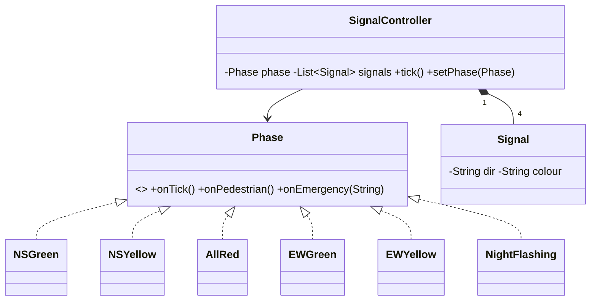

# Design Traffic Signal Control System — Concept

## What Is It?

A controller for a **four-way intersection** where each direction has **signals** (red / yellow / green) cycling on **timers**, with **pedestrian buttons** and an **emergency override**. The State + Singleton Easy problem — exactly one direction green, transitions on timer events.

| | |
|---|---|
| **Difficulty** | Easy |
| **Patterns** | State, Singleton |
| **Core** | NS-green → NS-yellow → all-red → EW-green → EW-yellow → all-red, on repeat |

---

## Requirements

**Functional**
- Each of 4 directions has a **signal**; exactly one axis green at a time with an **all-red clearance** between switches.
- **Fixed-time cycle** with configurable green/yellow durations; **pedestrian request** extends the next red-to-walk phase.
- **Emergency override** — green corridor for the emergency direction, then resume the cycle.
- **Night mode** — flashing yellow on all signals.

**Non-functional**
- Illegal combinations (two greens) must be unrepresentable — states, not booleans.
- Tick source (timer vs manual test driver) must be injectable.

---

## Core Entities

| Entity | Responsibility |
|--------|----------------|
| `SignalController` (Singleton) | Owns signals + current phase; `tick()` advances time |
| `Phase` (State) | `onEnter / onTick / onPedestrian / onEmergency` per phase |
| `NSGreen / NSYellow / AllRed / EWGreen / EWYellow` | The cycle states |
| `NightFlashing` / `EmergencyHold` | Override states |
| `Signal` | Direction + colour; only the controller mutates it |
| `Timer` (Strategy) | Fixed durations; test driver injects manual ticks |

---

## Class Diagram

---

## Related

- [[../00 - Index|Easy Problems Index]]
- [[../../00 - Index|LLD Problems Index]]
- [[../../../00 - Index|LLD Main Index]]
- [[../../../Patterns/Behavioural/17 - State/Concept|State]] · [[../../../UML/05 - State Machine Diagram/Concept|State Machine Diagram]]

---

#lld #machine-coding #traffic-signal #easy #concept
