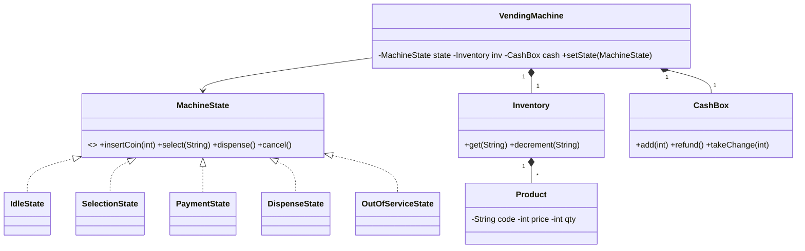

# Design a Vending Machine — Concept

## What Is It?

A machine holding **products** in **slots** that takes **coins/notes**, lets a user **select**, **pays**, **dispenses** with **change**, and can be **refilled** or put **out of service**. The canonical State-pattern Easy problem — every button press is a guarded state transition.

| | |
|---|---|
| **Difficulty** | Easy |
| **Patterns** | State, Singleton |
| **Core** | Idle → Selection → Payment → Dispense; inventory + cash as the two ledgers |

---

## Requirements

**Functional**
- Stock **products** (code, name, price, quantity) in selectable slots; **refill** by operator.
- Accept **coins/notes**; track inserted amount; **cancel** refunds everything inserted.
- **Select** a product only when in stock and affordable; **dispense** product + **change**.
- Operator can take the machine **out of service** and **collect cash**.

**Non-functional**
- Adding a payment mode (card) must not rewrite the selection flow — states behind one interface.
- Concurrent button presses must not dispense twice — transitions are atomic.

---

## Core Entities

| Entity | Responsibility |
|--------|----------------|
| `VendingMachine` (context) | Holds state, inventory, cash; delegates every action to the current state |
| `MachineState` (interface) | `insertCoin / select / dispense / cancel / refill / service` |
| `IdleState` | Waits for money; only `insertCoin` moves forward |
| `SelectionState` | Money in; `select` validates stock + funds → Payment/Dispense |
| `PaymentState` | Collects until price covered; `cancel` refunds |
| `DispenseState` | Drops product + change, returns to Idle |
| `OutOfServiceState` | Everything rejected except `service` (repair) |
| `Product` / `Inventory` | Slot catalogue + quantities |
| `CashBox` | Coins/notes held; change computation |

---

## Class Diagram

---

## Related

- [[../00 - Index|Easy Problems Index]]
- [[../../00 - Index|LLD Problems Index]]
- [[../../../00 - Index|LLD Main Index]]
- [[../../../Patterns/Behavioural/17 - State/Concept|State]] · [[../../../Patterns/Creational/01 - Singleton/Concept|Singleton]] · [[../../../UML/05 - State Machine Diagram/Concept|State Machine Diagram]]

---

#lld #machine-coding #vending-machine #easy #concept
