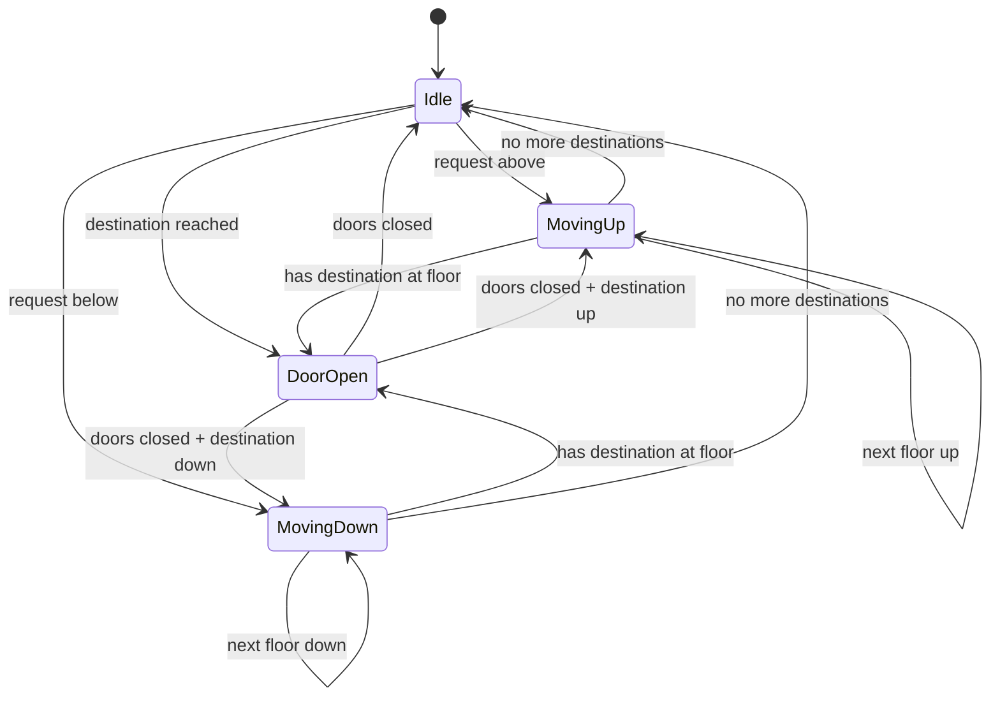

# 🛗 LLD Problem: Design an Elevator System

#### Problem Statement
Design an elevator system for a building with multiple floors. The system should handle multiple elevators, process floor requests from both inside and outside the elevator, and optimize elevator movement efficiently.

#### Core Requirements
- Multiple elevators serving a building with N floors.
- Users can request an elevator from a floor (outside request).
- Users inside an elevator can select destination floors (inside request).
- Elevators move up, down, or remain idle.
- Doors open/close automatically.
- Handle requests from multiple floors concurrently.
- Support idle elevator sitting at a floor.
- Handle max capacity constraints (optional: weight/limit).

#### High-Level Components
- **ElevatorSystem / ElevatorController**: Central coordinator managing multiple elevators.
- **Elevator**: Individual elevator with its own state (moving, doors, direction).
- **Floor**: Represents a floor with up/down buttons (external requests).
- **Request**: Internal or external request for elevator service.
- **Button**: Internal floor selection buttons, external up/down buttons.
- **State Pattern**: Elevator states (Idle, MovingUp, MovingDown, DoorOpen).
- **Strategy Pattern**: For scheduling algorithm (which elevator to assign).

---

#### Class Diagram (Conceptual)

```mermaid
classDiagram
    class ElevatorSystem {
        -List~Elevator~ elevators
        -List~Floor~ floors
        -SchedulingStrategy strategy
        +requestElevator(int floor, Direction direction)
        +assignElevator(Request request)
        +getStatus()
    }

    class Elevator {
        -int id
        -int currentFloor
        -Direction direction
        -State state
        -Set~Integer~ destinations
        -int capacity
        -int currentLoad
        +moveUp()
        +moveDown()
        +openDoor()
        +closeDoor()
        +addDestination(int floor)
        +processNextDestination()
        +stopAtFloor(int floor)
        +getIdleFloor()
    }

    class Floor {
        -int floorNumber
        -Button upButton
        -Button downButton
        +pressUp()
        +pressDown()
    }

    class Request {
        -int floor
        -Direction direction
        -RequestType type
    }

    class Button {
        -boolean isPressed
        +press()
        +reset()
    }

    interface State {
        +handleRequest(Elevator elevator, Request request)
        +move(Elevator elevator)
        +openDoor(Elevator elevator)
        +closeDoor(Elevator elevator)
    }

    class IdleState {
        +handleRequest(Elevator elevator, Request request)
        +move(Elevator elevator)
        +openDoor(Elevator elevator)
        +closeDoor(Elevator elevator)
    }

    class MovingUpState {
        +handleRequest(Elevator elevator, Request request)
        +move(Elevator elevator)
        +openDoor(Elevator elevator)
        +closeDoor(Elevator elevator)
    }

    class MovingDownState {
        +handleRequest(Elevator elevator, Request request)
        +move(Elevator elevator)
        +openDoor(Elevator elevator)
        +closeDoor(Elevator elevator)
    }

    class DoorOpenState {
        +handleRequest(Elevator elevator, Request request)
        +move(Elevator elevator)
        +openDoor(Elevator elevator)
        +closeDoor(Elevator elevator)
    }

    interface SchedulingStrategy {
        +assignElevator(List~Elevator~ elevators, Request request)
    }

    class FifoSchedulingStrategy {
        +assignElevator(List~Elevator~ elevators, Request request)
    }

    class LookSchedulingStrategy {
        +assignElevator(List~Elevator~ elevators, Request request)
    }

    ElevatorSystem "1" -- "*" Elevator : manages
    ElevatorSystem "1" -- "*" Floor : manages
    ElevatorSystem "1" -- "1" SchedulingStrategy : uses
    Elevator "1" -- "1" State : has
    Elevator "1" -- "*" Button : has
    State <|.. IdleState
    State <|.. MovingUpState
    State <|.. MovingDownState
    State <|.. DoorOpenState
    SchedulingStrategy <|.. FifoSchedulingStrategy
    SchedulingStrategy <|.. LookSchedulingStrategy
```

---

#### State Diagram



---

#### Key Design Decisions & Patterns

1. **State Pattern**: Elevator behavior changes based on state (Idle, MovingUp, MovingDown, DoorOpen). Each state encapsulates what operations are valid, preventing invalid operations like opening the door while moving.

2. **Strategy Pattern for Scheduling**: The `ElevatorController` delegates elevator assignment to a `SchedulingStrategy`:
   - **FIFO**: Assign earliest request to nearest available elevator (simple but suboptimal).
   - **LOOK (Elevator Algorithm)**: Elevators continue in their current direction, servicing requests along the way. Only reverse direction when no more requests ahead.
   - **Scan (Elevator Algorithm) / SCAN**: Elevator moves to the top, then down, serving requests along the way (fair but can be slow for far-away requests).

3. **Thread Safety**: The elevator system handles concurrent requests. Use `ConcurrentHashMap` or `CopyOnWriteArraySet` for destinations, or synchronize critical methods.

4. **Command Pattern (Optional)**: Encapsulate button presses as `Request` objects so the controller can queue/schedule them.

---

#### Example Code Snippets (Illustrative)

```java
// Direction Enum
public enum Direction {
    UP, DOWN, IDLE
}

// Request Class
public class Request {
    private final int floor;
    private final Direction direction; // Direction the user wants to go
    private final RequestType type;

    public enum RequestType { EXTERNAL, INTERNAL }

    public Request(int floor, Direction direction, RequestType type) {
        this.floor = floor;
        this.direction = direction;
        this.type = type;
    }

    public int getFloor() { return floor; }
    public Direction getDirection() { return direction; }
    public RequestType getType() { return type; }
}

// State Interface
public interface ElevatorState {
    void handleRequest(Elevator elevator, Request request);
    void move(Elevator elevator);
    void openDoor(Elevator elevator);
    void closeDoor(Elevator elevator);
}

// Idle State
public class IdleState implements ElevatorState {
    @Override
    public void handleRequest(Elevator elevator, Request request) {
        elevator.addDestination(request.getFloor());
        if (request.getFloor() > elevator.getCurrentFloor()) {
            elevator.setState(new MovingUpState());
            elevator.move();
        } else if (request.getFloor() < elevator.getCurrentFloor()) {
            elevator.setState(new MovingDownState());
            elevator.move();
        } else {
            // Already at the requested floor
            elevator.setState(new DoorOpenState());
            elevator.openDoor();
        }
    }

    @Override
    public void move(Elevator elevator) {
        // If idle, no movement unless there are destinations
        if (!elevator.getDestinations().isEmpty()) {
            int next = elevator.getNextDestination();
            if (next > elevator.getCurrentFloor()) {
                elevator.setState(new MovingUpState());
            } else if (next < elevator.getCurrentFloor()) {
                elevator.setState(new MovingDownState());
            }
            elevator.move();
        }
    }

    @Override
    public void openDoor(Elevator elevator) {
        elevator.setState(new DoorOpenState());
        elevator.openDoor();
    }

    @Override
    public void closeDoor(Elevator elevator) {
        // Already idle, doors should be closed
    }
}

// Moving Up State
public class MovingUpState implements ElevatorState {
    @Override
    public void handleRequest(Elevator elevator, Request request) {
        elevator.addDestination(request.getFloor());
    }

    @Override
    public void move(Elevator elevator) {
        elevator.setCurrentFloor(elevator.getCurrentFloor() + 1);
        elevator.processNextDestination(); // check if need to stop
    }

    @Override
    public void openDoor(Elevator elevator) {
        throw new IllegalStateException("Cannot open door while moving up");
    }

    @Override
    public void closeDoor(Elevator elevator) {
        // Already closed
    }
}

// Moving Down State
public class MovingDownState implements ElevatorState {
    @Override
    public void handleRequest(Elevator elevator, Request request) {
        elevator.addDestination(request.getFloor());
    }

    @Override
    public void move(Elevator elevator) {
        elevator.setCurrentFloor(elevator.getCurrentFloor() - 1);
        elevator.processNextDestination();
    }

    @Override
    public void openDoor(Elevator elevator) {
        throw new IllegalStateException("Cannot open door while moving down");
    }

    @Override
    public void closeDoor(Elevator elevator) {
        // Already closed
    }
}

// Door Open State
public class DoorOpenState implements ElevatorState {
    @Override
    public void handleRequest(Elevator elevator, Request request) {
        elevator.addDestination(request.getFloor());
    }

    @Override
    public void move(Elevator elevator) {
        throw new IllegalStateException("Cannot move while door is open");
    }

    @Override
    public void openDoor(Elevator elevator) {
        // Already open — do nothing
    }

    @Override
    public void closeDoor(Elevator elevator) {
        elevator.closeDoor(); // actual door close
        if (elevator.getDestinations().isEmpty()) {
            elevator.setState(new IdleState());
        } else {
            int next = elevator.getNextDestination();
            if (next > elevator.getCurrentFloor()) {
                elevator.setState(new MovingUpState());
            } else if (next < elevator.getCurrentFloor()) {
                elevator.setState(new MovingDownState());
            } else {
                elevator.setState(new IdleState());
            }
        }
    }
}

// Elevator Class
import java.util.*;
import java.util.concurrent.CopyOnWriteArraySet;

public class Elevator {
    private final int id;
    private int currentFloor;
    private Direction direction;
    private ElevatorState state;
    private final Set<Integer> destinations; // thread-safe

    public Elevator(int id, int startFloor) {
        this.id = id;
        this.currentFloor = startFloor;
        this.direction = Direction.IDLE;
        this.destinations = new CopyOnWriteArraySet<>();
        this.state = new IdleState();
    }

    public synchronized void request(Request request) {
        state.handleRequest(this, request);
    }

    public synchronized void move() {
        state.move(this);
    }

    public synchronized void openDoor() {
        state.openDoor(this);
    }

    public synchronized void closeDoor() {
        state.closeDoor(this);
    }

    public void addDestination(int floor) {
        destinations.add(floor);
    }

    public void processNextDestination() {
        if (destinations.contains(currentFloor)) {
            destinations.remove(currentFloor);
            state = new DoorOpenState();
            openDoor();
            System.out.println("Elevator " + id + " stopping at floor " + currentFloor);
        }
        if (destinations.isEmpty()) {
            direction = Direction.IDLE;
        }
    }

    public int getNextDestination() {
        return destinations.stream()
            .mapToInt(Integer::intValue)
            .min(Comparator.comparingInt(f -> Math.abs(f - currentFloor)))
            .orElse(currentFloor);
    }

    // Getters and Setters
    public int getId() { return id; }
    public int getCurrentFloor() { return currentFloor; }
    public void setCurrentFloor(int floor) { this.currentFloor = floor; }
    public Direction getDirection() { return direction; }
    public void setDirection(Direction direction) { this.direction = direction; }
    public ElevatorState getState() { return state; }
    public void setState(ElevatorState state) { this.state = state; }
    public Set<Integer> getDestinations() { return destinations; }
}

// Scheduling Strategy
public interface SchedulingStrategy {
    Elevator assignElevator(List<Elevator> elevators, Request request);
}

// LOOK Scheduling (Elevator Algorithm)
public class LookSchedulingStrategy implements SchedulingStrategy {
    @Override
    public Elevator assignElevator(List<Elevator> elevators, Request request) {
        Elevator best = null;
        int bestDistance = Integer.MAX_VALUE;

        for (Elevator elevator : elevators) {
            int currentFloor = elevator.getCurrentFloor();
            Direction elevatorDirection = elevator.getDirection();

            // Case 1: Elevator is idle — pick the closest one
            if (elevatorDirection == Direction.IDLE) {
                int distance = Math.abs(currentFloor - request.getFloor());
                if (distance < bestDistance) {
                    bestDistance = distance;
                    best = elevator;
                }
            }
            // Case 2: Elevator is moving in the same direction and the floor is ahead
            else if (elevatorDirection == request.getDirection()) {
                boolean isAhead = elevatorDirection == Direction.UP
                        ? request.getFloor() >= currentFloor
                        : request.getFloor() <= currentFloor;
                if (isAhead) {
                    int distance = Math.abs(currentFloor - request.getFloor());
                    if (distance < bestDistance) {
                        bestDistance = distance;
                        best = elevator;
                    }
                }
            }
        }

        // If no optimum found, fall back to closest idle or first
        if (best == null) {
            best = elevators.stream()
                .min(Comparator.comparingInt(e -> Math.abs(e.getCurrentFloor() - request.getFloor())))
                .orElse(elevators.get(0));
        }

        return best;
    }
}

// Elevator Controller / System
import java.util.*;

public class ElevatorSystem {
    private final List<Elevator> elevators;
    private final SchedulingStrategy strategy;
    private final Queue<Request> pendingRequests = new LinkedList<>();

    public ElevatorSystem(int numElevators, int startFloor, SchedulingStrategy strategy) {
        this.elevators = new ArrayList<>();
        for (int i = 1; i <= numElevators; i++) {
            elevators.add(new Elevator(i, startFloor));
        }
        this.strategy = strategy;
    }

    public void requestElevator(int floor, Direction direction) {
        Request request = new Request(floor, direction, Request.RequestType.EXTERNAL);
        handleRequest(request);
    }

    public void requestFloor(int elevatorId, int floor) {
        Elevator elevator = elevators.get(elevatorId - 1);
        Request request = new Request(floor, null, Request.RequestType.INTERNAL);
        elevator.request(request);
    }

    private synchronized void handleRequest(Request request) {
        Elevator assigned = strategy.assignElevator(elevators, request);
        System.out.println("Assigning request to floor " + request.getFloor()
            + " to Elevator " + assigned.getId());
        assigned.request(request);
    }

    public List<Elevator> getElevators() { return elevators; }
}

// Example usage
public class Main {
    public static void main(String[] args) {
        ElevatorSystem system = new ElevatorSystem(3, 1, new LookSchedulingStrategy());

        // User on floor 5 wants to go up
        system.requestElevator(5, Direction.UP);

        // User on floor 3 wants to go down
        system.requestElevator(3, Direction.DOWN);

        // User inside elevator 1 presses floor 8
        system.requestFloor(1, 8);

        // Simulate stepping
        for (Elevator elevator : system.getElevators()) {
            elevator.move();
        }
    }
}
```

---

#### Concurrency Considerations

- `ElevatorSystem.handleRequest()` is `synchronized` to avoid race conditions when multiple users press buttons simultaneously.
- `Elevator.destinations` uses `CopyOnWriteArraySet` — safe for concurrent reads/writes, though it has higher write cost.
- `Elevator.move()` and `processNextDestination()` are `synchronized` to prevent a request arriving mid-move causing inconsistent state.
- For a real production system, consider a **dedicated scheduler thread** that polls a blocking queue of requests.

#### Interview Discussion Points

1. **Which scheduling algorithm would you choose in production?**
   - **LOOK** is best for typical office buildings: it minimizes direction changes.
   - **SCAN** is simpler but less efficient when requests cluster in a zone.
   - **Priority-based** scheduling can be added for VIP/emergency requests.

2. **How do you handle capacity constraints?**
   - Track `currentLoad` per elevator.
   - If max capacity reached, mark elevator as unavailable until unload.
   - Strategy wouldn't assign new requests unless they're along the current path.

3. **How would you handle a fire alarm / emergency?**
   - Elevators return to ground floor.
   - Disable all external requests.

4. **How do you prevent starvation?**
   - Use a request queue with timestamps.
   - If a request waits too long, force-assign an elevator (even if direction changes).

5. **How would you handle the "most likely next floor" prediction?**
   - Analyze historical usage patterns to pre-position idle elevators.
   - E.g., morning peak → park elevators near lobby.

---

## 🔗 Related
- [[00 - Roadmap]]
- [[Problems/Parking-Lot]]
- [[Problems/Vending-Machine]]
- [[09 - Rapid-Fire Concepts]]