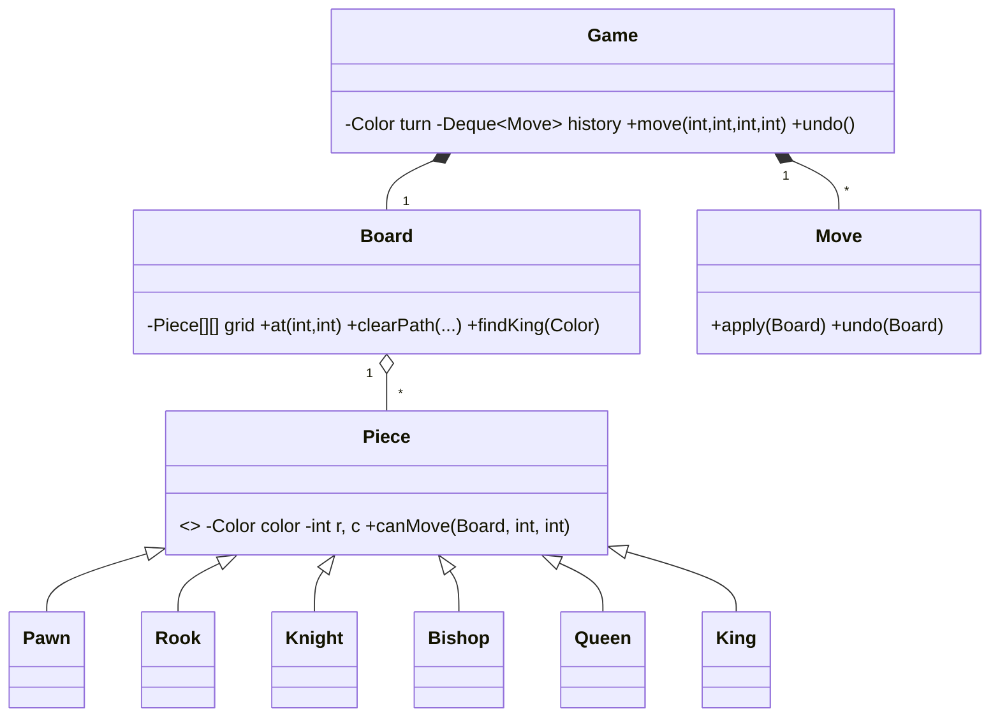

# Design Chess Game — Concept

## What Is It?

A **chess engine** on an 8×8 board: pieces with distinct movement rules, alternating turns, capture handling, **check** detection, and **undo** via move history. The canonical Hard board-game problem — polymorphic move validation plus Command-style reversible moves.

| | |
|---|---|
| **Difficulty** | Hard |
| **Patterns** | Command, State |
| **Core** | piece polymorphism validates geometry → Game applies/undoes `Move` commands → king safety decides legality |

---

## Requirements

**Functional**
- Standard **8×8 setup**; WHITE moves first; turns alternate strictly.
- **Movement per piece**: pawn (single/double step, diagonal capture), rook, bishop, queen (path-cleared), knight (jump), king (one step).
- **Capture** enemy pieces; never your own; path must be clear for sliding pieces.
- A move that leaves your own king **in check** is illegal and must be rejected.
- **Undo** the last move, restoring the board and the turn.
- Report **check** when the opponent's king is attacked.

**Non-functional**
- Adding a piece type must not touch `Game`; move validation belongs to the piece.
- Move/undo is exact — no board cloning, no drift after any sequence.

---

## Core Entities

| Entity | Responsibility |
|--------|----------------|
| `Game` | Turn state, apply/undo `Move`, check detection |
| `Board` | 8×8 grid, `clearPath`, king lookup |
| `Piece` (abstract) | Color + position + `canMove(board, r, c)` |
| `Pawn / Rook / Knight / Bishop / Queen / King` | Geometry per type |
| `Move` (Command) | `apply` / `undo` capturing both squares |
| `Color` | `WHITE / BLACK` |

---

## Class Diagram

---

## Related

- [[../00 - Index|Hard Problems Index]]
- [[../../00 - Index|LLD Problems Index]]
- [[../../../00 - Index|LLD Main Index]]
- [[../../../Patterns/Behavioural/16 - Command/Concept|Command]] · [[../../../Patterns/Behavioural/17 - State/Concept|State]] · [[../../Medium/Design-Tic-Tac-Toe/Concept|Tic Tac Toe]]

---

#lld #machine-coding #chess #hard #concept