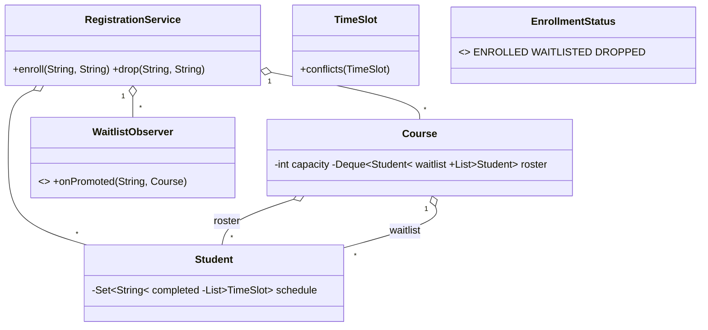

# Design Course Registration System — Concept

## What Is It?

A **university course registration** service: students enroll in capped courses, overflow joins a **FIFO waitlist**, drops promote the next waiter, and checks cover **prerequisites** and **time conflicts**. The canonical Hard capacity problem — invariant: no course ever exceeds capacity.

| | |
|---|---|
| **Difficulty** | Hard |
| **Patterns** | Observer, State |
| **Core** | capacity + FIFO waitlist with auto-promotion + pre-checks (prereq, conflict) |

---

## Requirements

**Functional**
- **Courses**: code, capacity, weekly `TimeSlot`, prerequisite set.
- **Enroll**: validate prerequisites, check time conflicts with the student's other courses, then place — or **waitlist** when full.
- **Drop**: frees a seat; the first waiter is **promoted and notified**; dropping from the waitlist simply leaves it.
- Enrollment status per (student, course): `ENROLLED / WAITLISTED / DROPPED`.

**Non-functional**
- Concurrent enrollment never overfills a course; the waitlist is strictly FIFO.

---

## Core Entities

| Entity | Responsibility |
|--------|----------------|
| `RegistrationService` (facade) | Enrollment checks, roster/waitlist moves, notifications |
| `Student` | Completed courses + current schedule |
| `Course` | Capacity, slot, prerequisites, roster, waitlist |
| `TimeSlot` | Day + hours; `conflicts` is interval overlap |
| `EnrollmentStatus` | Per (student, course) status |
| `WaitlistObserver` | Told when a waiter is promoted |

---

## Class Diagram

---

## Related

- [[../00 - Index|Hard Problems Index]]
- [[../../00 - Index|LLD Problems Index]]
- [[../../../00 - Index|LLD Main Index]]
- [[../../../Patterns/Behavioural/14 - Observer/Concept|Observer]] · [[../../../Patterns/Behavioural/17 - State/Concept|State]] · [[../../Medium/Design-Library-Management-System/Concept|Library Management]]

---

#lld #machine-coding #course-registration #hard #concept