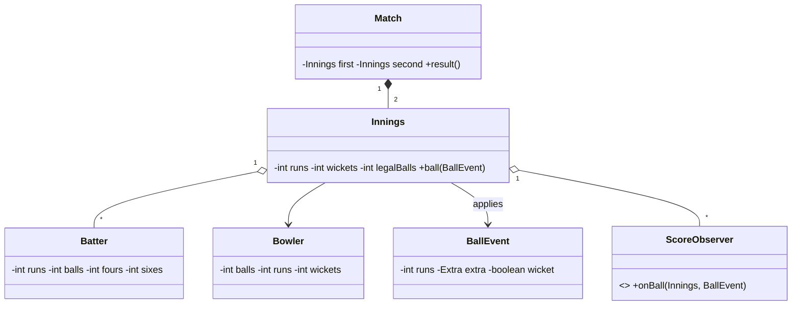

# Design CricInfo — Concept

## What Is It?

A **live cricket scoring service** — every delivery is an event that updates runs, wickets, overs, and both batters' and the bowler's stats, while scorecards and commentary fan out to viewers in real time. The canonical Hard event-sourcing problem: **ball events are the truth**, scorecards are projections.

| | |
|---|---|
| **Difficulty** | Hard |
| **Patterns** | Observer, Command |
| **Core** | immutable ball events → innings state machine → observers get every update |

---

## Requirements

**Functional**
- **Start a match** — two teams, innings order; openers and bowler take the field.
- **Record a ball**: 0–6 runs, extras (`WIDE`, `NO_BALL`), or a **wicket**.
- Auto rules: odd runs rotate strike; end of over rotates strike and changes bowler; next batter walks in on a wicket.
- **Stats** live: batter (runs/balls/4s/6s), bowler (balls/runs/wickets), innings score and overs.
- **Innings ends** on 10 wickets or the over quota; the chase is decided on runs.
- **Live updates** — scoreboard and commentary observers fire on every event.

**Non-functional**
- The ball log is append-only and replayable; scorecard reads never mutate state.

---

## Core Entities

| Entity | Responsibility |
|--------|----------------|
| `Match` | Two innings, result computation (chase wins by wickets, etc.) |
| `Innings` | Runs, wickets, legal balls, strike rotation, ball log |
| `BallEvent` (Command) | Immutable `{runs, extra, wicket}` — the atom of truth |
| `Batter` / `Bowler` | Live per-player stats |
| `ScoreObserver` | Scoreboard display, commentary, analytics |
| `Commentary` | Human-readable text per ball |

---

## Class Diagram

---

## Related

- [[../00 - Index|Hard Problems Index]]
- [[../../00 - Index|LLD Problems Index]]
- [[../../../00 - Index|LLD Main Index]]
- [[../../../Patterns/Behavioural/14 - Observer/Concept|Observer]] · [[../../../Patterns/Behavioural/16 - Command/Concept|Command]] · [[../Design-Snake-and-Ladder/Concept|Snake and Ladder]]

---

#lld #machine-coding #cricinfo #hard #concept