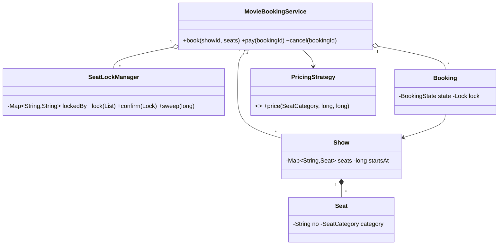

# Design Movie Ticket Booking System — Concept

## What Is It?

A **movie ticketing service**: movies play as **shows** on screens with fixed seat maps; users **lock seats** briefly, pay, and confirm — expired locks return seats to the pool. The canonical Hard seat-lock problem — a dedicated `SeatLockManager` owns who holds what until when.

| | |
|---|---|
| **Difficulty** | Hard |
| **Patterns** | State, Strategy |
| **Core** | seat lock manager with TTL + booking state machine + time/seat pricing |

---

## Requirements

**Functional**
- Movies → **shows** (screen + start time) with seat maps (regular / premium / recliner).
- **Lock** a set of seats for a booking (TTL); **pay** to confirm; **cancel** to release.
- Booking states: `PENDING → CONFIRMED → CANCELLED`; expired locks auto-release **and** expire the booking.
- **Pricing** by seat category and show time (matinee cheaper, prime-time pricier).

**Non-functional**
- A seat is never locked/sold twice under concurrency; expiry needs no user action.

---

## Core Entities

| Entity | Responsibility |
|--------|----------------|
| `MovieBookingService` (facade) | Shows, bookings, payment, clock |
| `Show` | Movie, screen, start time, seat map |
| `Seat` | Number + category |
| `SeatLockManager` | Per-show locks: `lockedBy`, `lockedUntil`, `sold`; sweep |
| `Booking` | Seats + lock token + state |
| `PricingStrategy` | Price for (category, show, now) |

---

## Class Diagram

---

## Related

- [[../00 - Index|Hard Problems Index]]
- [[../../00 - Index|LLD Problems Index]]
- [[../../../00 - Index|LLD Main Index]]
- [[../../../Patterns/Behavioural/17 - State/Concept|State]] · [[../../../Patterns/Behavioural/15 - Strategy/Concept|Strategy]] · [[../../Medium/Design-Concert-Ticket-Booking-System/Concept|Concert Tickets]]

---

#lld #machine-coding #movie-tickets #hard #concept