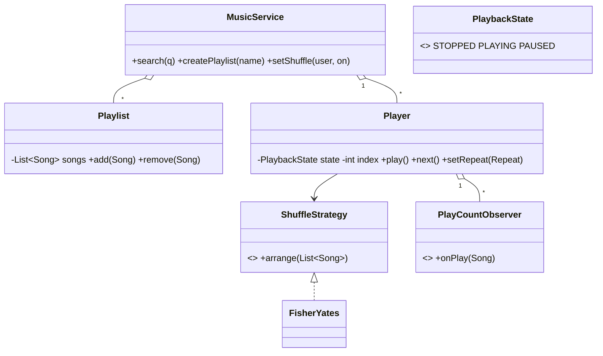

# Design Music Streaming Service like Spotify — Concept

## What Is It?

A **music streaming service**: a catalogue of artists/albums/songs, user **playlists**, a **player** that moves `STOPPED → PLAYING → PAUSED` with next/previous, and **shuffle/repeat** behaviors — with subscription tiers gating features. The canonical Hard stateful-media problem.

| | |
|---|---|
| **Difficulty** | Hard |
| **Patterns** | State, Strategy, Observer |
| **Core** | player state machine over a queue + shuffle/repeat strategies + play-count observers |

---

## Requirements

**Functional**
- **Catalogue**: songs with artist metadata; **search** by title/artist.
- **Playlists**: create, add/remove songs; play a playlist as a queue.
- **Player**: `play / pause / stop / next / previous` with legal transitions only; `repeat OFF / ONE / ALL`; **shuffle** on/off (re-arranges the queue).
- **Play counts** — every playback notifies observers (royalties, recommendations).
- **Tiers**: FREE users keep shuffle forced on; PREMIUM can choose album order.

**Non-functional**
- Illegal transitions throw (no skipping from STOPPED); shuffle is a swappable strategy.

---

## Core Entities

| Entity | Responsibility |
|--------|----------------|
| `MusicService` (facade) | Catalogue, playlists, players, tier gating |
| `Song` | Id, title, artist, duration |
| `Playlist` | Ordered song list |
| `Player` | Queue, index, `PlaybackState`, repeat, shuffle strategy |
| `ShuffleStrategy` | `InOrder` / `FisherYates` |
| `PlayCountObserver` | Notified on every playback |

---

## Class Diagram

---

## Related

- [[../00 - Index|Hard Problems Index]]
- [[../../00 - Index|LLD Problems Index]]
- [[../../../00 - Index|LLD Main Index]]
- [[../../../Patterns/Behavioural/17 - State/Concept|State]] · [[../../../Patterns/Behavioural/15 - Strategy/Concept|Strategy]] · [[../Design-Online-Shopping-System/Concept|Online Shopping]]

---

#lld #machine-coding #spotify #hard #concept