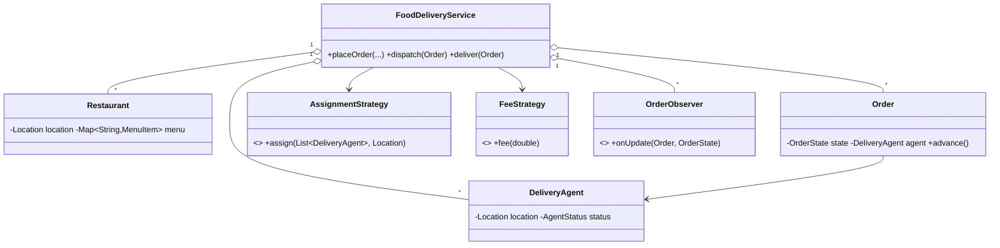

# Design Online Food Delivery Service like Swiggy — Concept

## What Is It?

A **food delivery platform**: restaurants publish menus, users order, the kitchen prepares, the platform assigns the **nearest delivery agent**, and the order is tracked to the door. The canonical Hard logistics problem — three parties, one order state machine, status fan-out.

| | |
|---|---|
| **Difficulty** | Hard |
| **Patterns** | State, Strategy, Observer |
| **Core** | order lifecycle PLACED → … → DELIVERED + nearest-agent dispatch + distance-based fee |

---

## Requirements

**Functional**
- **Restaurants** with menus; browse and build a **cart**; **place order** (items validated against the menu).
- Lifecycle: `PLACED → CONFIRMED → PREPARING → OUT_FOR_DELIVERY → DELIVERED`; **cancel** before dispatch; cancel frees the agent.
- **Dispatch** assigns the **nearest available agent** atomically; delivery frees them.
- **Delivery fee** by restaurant→customer distance (base + per-km), pluggable.
- **Status observers** — the customer tracking screen hears every transition.

**Non-functional**
- An agent is never on two deliveries; every state change is observed exactly once.

---

## Core Entities

| Entity | Responsibility |
|--------|----------------|
| `FoodDeliveryService` (facade) | Restaurants, orders, agents, dispatch, observers |
| `Restaurant` | Menu + location |
| `MenuItem` | Name + price |
| `Cart` | Item lines |
| `Order` | Lifecycle state machine + assigned agent + dropoff |
| `DeliveryAgent` | Location + `AVAILABLE / ON_DELIVERY` |
| `AssignmentStrategy` / `FeeStrategy` | Nearest agent; distance fee |

---

## Class Diagram

---

## Related

- [[../00 - Index|Hard Problems Index]]
- [[../../00 - Index|LLD Problems Index]]
- [[../../../00 - Index|LLD Main Index]]
- [[../../../Patterns/Behavioural/17 - State/Concept|State]] · [[../../../Patterns/Behavioural/14 - Observer/Concept|Observer]] · [[../Design-Ride-Sharing-Service/Concept|Ride-Sharing]]

---

#lld #machine-coding #swiggy #hard #concept