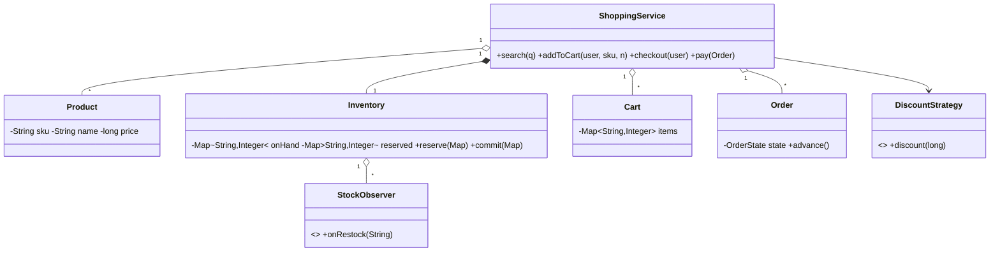

# Design Online Shopping System like Amazon — Concept

## What Is It?

The core of an **e-commerce platform**: product catalogue, cart, checkout that **reserves inventory**, an order state machine, and cancellations that restore stock. The canonical Hard commerce problem — inventory correctness across checkout, payment, shipping, and returns.

| | |
|---|---|
| **Difficulty** | Hard |
| **Patterns** | State, Strategy, Observer |
| **Core** | reserve → pay → ship → deliver; every cancel path restores what it took |

---

## Requirements

**Functional**
- **Catalogue** with search; **cart** per user (add / remove / quantities).
- **Checkout** reserves stock **all-or-nothing**; order states `CREATED → PAID → SHIPPED → DELIVERED`, `CANCELLED` from CREATED/PAID.
- **Cancel** restores inventory appropriately (release reservation or restock committed stock).
- **Pricing** with discount strategies over the cart subtotal.
- **Restock observers** notified when a product becomes available again.

**Non-functional**
- Available stock = on-hand − reserved is never negative across concurrent checkouts.

---

## Core Entities

| Entity | Responsibility |
|--------|----------------|
| `ShoppingService` (facade) | Catalogue, carts, checkout, order flow |
| `Product` | SKU, name, price |
| `Inventory` | On-hand + reserved; `reserve / commit / release` |
| `Cart` | User's `sku → qty` map |
| `Order` | Items, state machine, guarded transitions |
| `DiscountStrategy` | Discount over subtotal |
| `StockObserver` | Restock notifications |

---

## Class Diagram

---

## Related

- [[../00 - Index|Hard Problems Index]]
- [[../../00 - Index|LLD Problems Index]]
- [[../../../00 - Index|LLD Main Index]]
- [[../../../Patterns/Behavioural/17 - State/Concept|State]] · [[../../../Patterns/Behavioural/15 - Strategy/Concept|Strategy]] · [[../Design-Online-Food-Delivery/Concept|Food Delivery]]

---

#lld #machine-coding #amazon #hard #concept