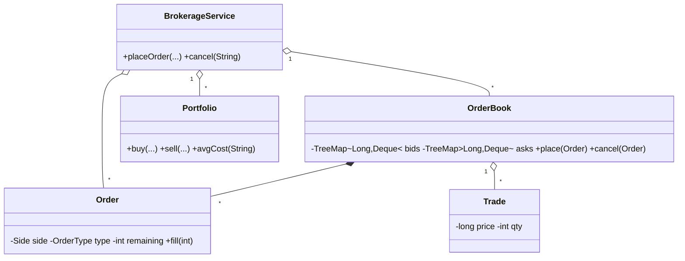

# Design Online Stock Brokerage System — Concept

## What Is It?

A **stock brokerage**: clients place limit/market **buy/sell orders**, a **price-time priority matching engine** fills them (with partial fills), and portfolios track holdings and cost basis. The canonical Hard matching problem — order books, fairness, and money.

| | |
|---|---|
| **Difficulty** | Hard |
| **Patterns** | Strategy, Observer |
| **Core** | two sorted books (TreeMap price → FIFO queue) + match loop + trade settlement |

---

## Requirements

**Functional**
- **Place orders**: BUY/SELL, LIMIT (resting allowed) or MARKET (immediate-or-cancel).
- **Match** with **price-time priority**: best price first, FIFO within a price level; **partial fills** leave the remainder open.
- **Cancel** open/partially filled orders; filled orders stay immutable.
- **Portfolio**: shares + average cost per symbol; **cash** checks — buys need funds, sells need shares.
- Every fill settles both sides: cash moves, portfolios update.

**Non-functional**
- Matching is deterministic; every trade moves money and shares exactly once.

---

## Core Entities

| Entity | Responsibility |
|--------|----------------|
| `BrokerageService` (facade) | Orders, books per symbol, settlement, cash checks |
| `Order` | Side, type, price, remaining qty, status |
| `OrderBook` | Bids/asks `TreeMap<price, Deque<Order>>`; match loop |
| `Trade` | Symbol, price, qty, buyer, seller |
| `Portfolio` | Shares + cost basis; `avgCost` |
| `OrderStatus` | `OPEN / PARTIAL / FILLED / CANCELLED` |

---

## Class Diagram

---

## Related

- [[../00 - Index|Hard Problems Index]]
- [[../../00 - Index|LLD Problems Index]]
- [[../../../00 - Index|LLD Main Index]]
- [[../../../Patterns/Behavioural/15 - Strategy/Concept|Strategy]] · [[../../../Patterns/Behavioural/16 - Command/Concept|Command]] · [[../../Medium/Design-Online-Auction-System/Concept|Auction]]

---

#lld #machine-coding #stock-brokerage #hard #concept