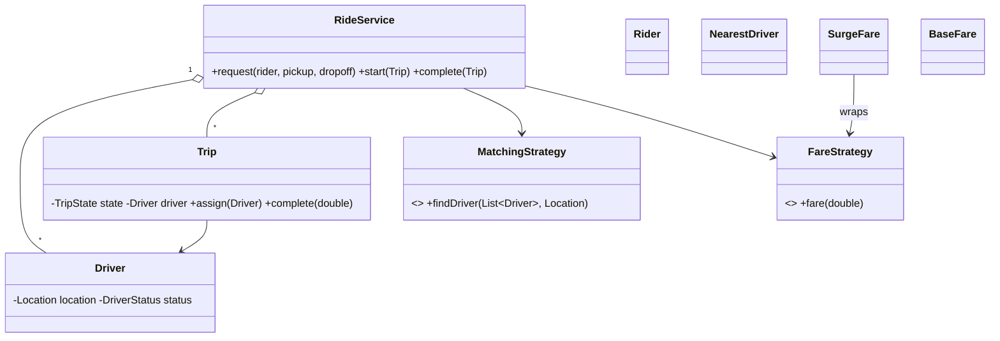

# Design Ride-Sharing Service like Uber — Concept

## What Is It?

A **ride-hailing service**: riders request trips, the platform matches the **nearest available driver** atomically, the trip flows `REQUESTED → ASSIGNED → IN_PROGRESS → COMPLETED`, and the fare comes from a pricing strategy with surge. The canonical Hard matching problem — geography, state machines, and money.

| | |
|---|---|
| **Difficulty** | Hard |
| **Patterns** | State, Strategy, Observer |
| **Core** | nearest-driver matching + trip/driver state pair + fare strategy (surge wraps base) |

---

## Requirements

**Functional**
- Riders **request** a trip (pickup, dropoff); the service picks the **nearest available driver**.
- Trip states: `REQUESTED → ASSIGNED → IN_PROGRESS → COMPLETED`; cancel allowed before pickup.
- Driver states: `AVAILABLE / ON_TRIP / OFFLINE` — assignment flips to ON_TRIP; completion flips back.
- **Fare** = base + per-km, with **surge** as a multiplier; payment charged at completion.

**Non-functional**
- One driver can never be assigned to two trips — matching + assignment is one atomic step.
- Matching and pricing policies are swappable strategies.

---

## Core Entities

| Entity | Responsibility |
|--------|----------------|
| `RideService` (facade) | Driver registry, matching, trip lifecycle |
| `Driver` | Id, live location, availability status |
| `Rider` | Identity + payment method |
| `Trip` | Pickup/dropoff, state machine, assigned driver, km, fare |
| `MatchingStrategy` | `findDriver(drivers, pickup)` — nearest wins |
| `FareStrategy` | Base fare; `SurgeFare` wraps it as a multiplier |
| `Location` | Coordinates + `distanceTo` |

---

## Class Diagram

---

## Related

- [[../00 - Index|Hard Problems Index]]
- [[../../00 - Index|LLD Problems Index]]
- [[../../../00 - Index|LLD Main Index]]
- [[../../../Patterns/Behavioural/17 - State/Concept|State]] · [[../../../Patterns/Behavioural/15 - Strategy/Concept|Strategy]] · [[../Design-Online-Food-Delivery/Concept|Food Delivery]]

---

#lld #machine-coding #uber #hard #concept