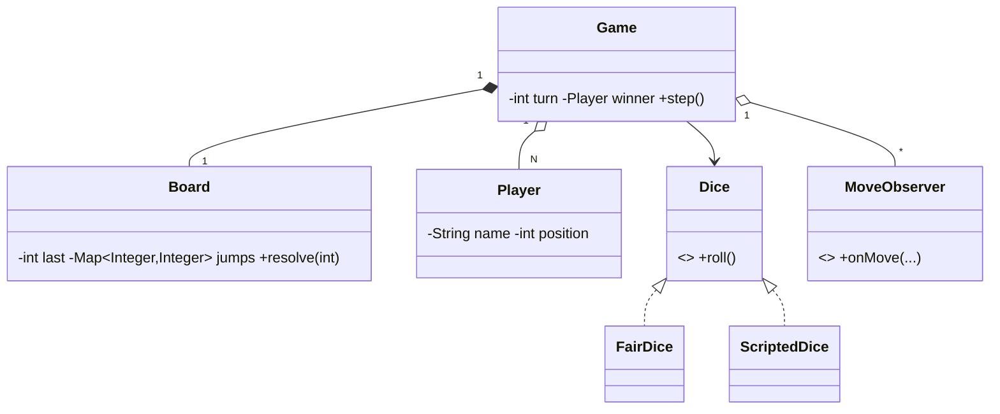

# Design a Snake and Ladder Game — Concept

## What Is It?

The classic **Snake and Ladder** board game: players take turns rolling a die, moving along a 100-cell board, riding **ladders** up and sliding down **snakes** — and needing an **exact roll** to land on the final cell. The canonical Hard turn-based game — deterministic rules, injectable dice, clean turn loop.

| | |
|---|---|
| **Difficulty** | Hard |
| **Patterns** | Strategy, Observer |
| **Core** | roll → move → resolve jump → win check; dice is a pluggable strategy |

---

## Requirements

**Functional**
- Configurable board: any size, with **ladders** (up) and **snakes** (down) as a jump map.
- 2+ players; turns rotate; each turn rolls a die and moves.
- **Overshoot stays** — you must land exactly on the last cell to win.
- Landing on a snake/ladder cell immediately moves you (one hop per turn).
- A **move log** observer records every roll and position change.

**Non-functional**
- Dice is replaceable (fair, loaded, scripted for tests) without touching the game.
- Game state is a pure function of rolls — deterministic under a scripted die.

---

## Core Entities

| Entity | Responsibility |
|--------|----------------|
| `Game` | Turn loop, winner detection, observers |
| `Board` | Last cell + jump map; `resolve(cell)` applies one snake/ladder |
| `Player` | Name + position |
| `Dice` (Strategy) | `roll()` — fair or scripted |
| `MoveObserver` | Roll log / UI updates |

---

## Class Diagram

---

## Related

- [[../00 - Index|Hard Problems Index]]
- [[../../00 - Index|LLD Problems Index]]
- [[../../../00 - Index|LLD Main Index]]
- [[../../../Patterns/Behavioural/15 - Strategy/Concept|Strategy]] · [[../../../Patterns/Behavioural/14 - Observer/Concept|Observer]] · [[../Design-CricInfo/Concept|CricInfo]]

---

#lld #machine-coding #snake-and-ladder #hard #concept