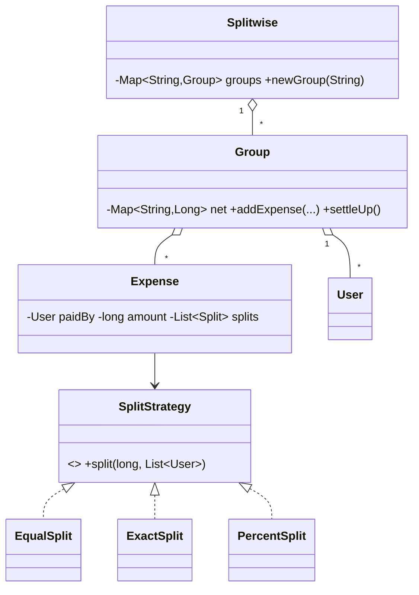

# Design Splitwise — Concept

## What Is It?

An **expense-sharing service** for groups: one member fronts a bill, participants owe their share according to a **split rule** (equal / exact / percent), and the group can always answer "who owes whom". The canonical Hard money-graph problem — net balances plus a minimal **settle-up**.

| | |
|---|---|
| **Difficulty** | Hard |
| **Patterns** | Strategy, Observer |
| **Core** | expense → splits → net balances; greedy settle-up to fewest transfers |

---

## Requirements

**Functional**
- **Users and groups**; members join groups and record **expenses** (payer + amount + split rule).
- **Split rules**: equal, exact amounts, percentages — splits must always sum to the expense.
- **Balances** — per member, net of everything: positive = gets money back, negative = owes.
- **Settle-up** — produce a short list of transfers that zeroes every balance.
- Group activity **notifies** members (Observer).

**Non-functional**
- Balances net to exactly zero — no money invented or lost in rounding.
- New split rules plug in without touching `Group`; money is integer arithmetic only.

---

## Core Entities

| Entity | Responsibility |
|--------|----------------|
| `Splitwise` (registry) | Groups by name |
| `Group` | Members, expenses, **net balance map**, settle-up |
| `User` | Identity |
| `Expense` | Payer + total + resolved splits |
| `SplitStrategy` | Turns (total, participants) into `Split`s — Equal/Exact/Percent |
| `SettleUp` | Greedy transfer list from net balances |

---

## Class Diagram

---

## Related

- [[../00 - Index|Hard Problems Index]]
- [[../../00 - Index|LLD Problems Index]]
- [[../../../00 - Index|LLD Main Index]]
- [[../../../Patterns/Behavioural/15 - Strategy/Concept|Strategy]] · [[../../../Patterns/Behavioural/14 - Observer/Concept|Observer]] · [[../Design-Online-Stock-Brokerage/Concept|Stock Brokerage]]

---

#lld #machine-coding #splitwise #hard #concept