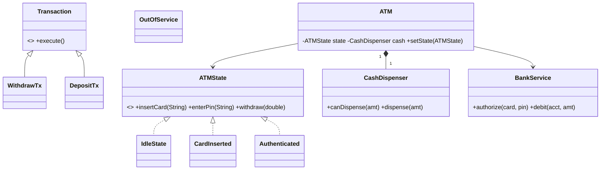

# Design ATM — Concept

## What Is It?

An **ATM** that reads a **card + PIN**, shows **accounts**, and dispenses **cash** for withdrawals while handling deposits, balance checks, and PIN changes. The classic State + Chain Medium problem — every screen is a guarded state, every transaction is atomic.

| | |
|---|---|
| **Difficulty** | Medium |
| **Patterns** | State, Chain of Responsibility, Singleton |
| **Core** | card → PIN → menu → transaction → cash; cassette + ledger move together |

---

## Requirements

**Functional**
- Authenticate by **card + PIN** (3 tries → card retained); support **balance**, **withdraw**, **deposit**, **PIN change**.
- Withdrawal checks **account balance** AND **cassette cash**; dispenses in denominations; prints mini-statement.
- Operator **refills cash** and takes the machine **out of service**.

**Non-functional**
- New transaction types plug in as handlers — no ATM class changes.
- Concurrent ATMs on one account must not double-spend — one transactional boundary.

---

## Core Entities

| Entity | Responsibility |
|--------|----------------|
| `ATM` (context) | Holds state, card reader, dispenser, bank link; delegates to state |
| `ATMState` (interface) | `insertCard / enterPin / select / eject` |
| `IdleState` / `CardInserted` / `Authenticated` / `OutOfService` | The screen flow |
| `Transaction` (chain) | `validate → authorize → execute`; withdraw / deposit / balance handlers |
| `BankService` | Authorizes + posts ledger entries |
| `CashDispenser` | Denomination inventory + dispense |

---

## Class Diagram

---

## Related

- [[../00 - Index|Medium Problems Index]]
- [[../../00 - Index|LLD Problems Index]]
- [[../../../00 - Index|LLD Main Index]]
- [[../../../Patterns/Behavioural/17 - State/Concept|State]] · [[../../../Patterns/Creational/01 - Singleton/Concept|Singleton]] · [[../../../UML/05 - State Machine Diagram/Concept|State Machine Diagram]]

---

#lld #machine-coding #atm #medium #concept
