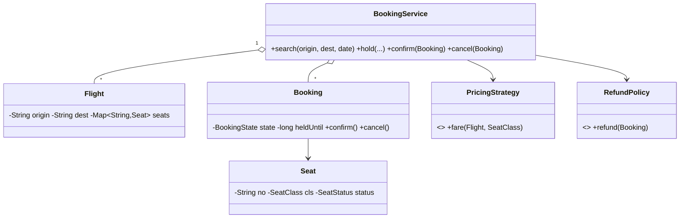

# Design Airline Management System — Concept

## What Is It?

An **airline reservation system**: search flights by route and date, pick seats from a cabin map, **hold** them briefly while paying, and confirm a booking — with cancellation refunds. The canonical Medium inventory-and-expiry problem — unpaid carts must release seats without human help.

| | |
|---|---|
| **Difficulty** | Medium |
| **Patterns** | State, Strategy, Observer |
| **Core** | seat hold with TTL + booking state machine (PENDING → CONFIRMED → CANCELLED) |

---

## Requirements

**Functional**
- **Search** flights by origin, destination, date; show seat availability per class.
- **Hold** seats for a passenger (temporary, expiring); **confirm** with payment; **cancel** with refund.
- Booking lifecycle: `PENDING → CONFIRMED → CANCELLED`; expired holds auto-cancel and free seats.
- **Fare** by class and time-to-departure; **refund policy** by how early the cancellation happens.

**Non-functional**
- A seat is never sold twice; abandoned holds release automatically.
- Pricing and refund rules plug in as strategies.

---

## Core Entities

| Entity | Responsibility |
|--------|----------------|
| `BookingService` (facade) | Search, hold, confirm, cancel, hold-expiry sweeps |
| `Flight` | Route, departure, seat map |
| `Seat` | Number, class, live status `FREE / HELD / BOOKED` |
| `Booking` | Passenger, flight, seats, state, `heldUntil` |
| `PricingStrategy` | Fare for (flight, class) — demand/day aware |
| `RefundPolicy` | Refund for a cancelled booking |

---

## Class Diagram

---

## Related

- [[../00 - Index|Medium Problems Index]]
- [[../../00 - Index|LLD Problems Index]]
- [[../../../00 - Index|LLD Main Index]]
- [[../../../Patterns/Behavioural/17 - State/Concept|State]] · [[../../../Patterns/Behavioural/15 - Strategy/Concept|Strategy]] · [[../Design-Concert-Ticket-Booking-System/Concept|Concert Tickets]]

---

#lld #machine-coding #airline #medium #concept