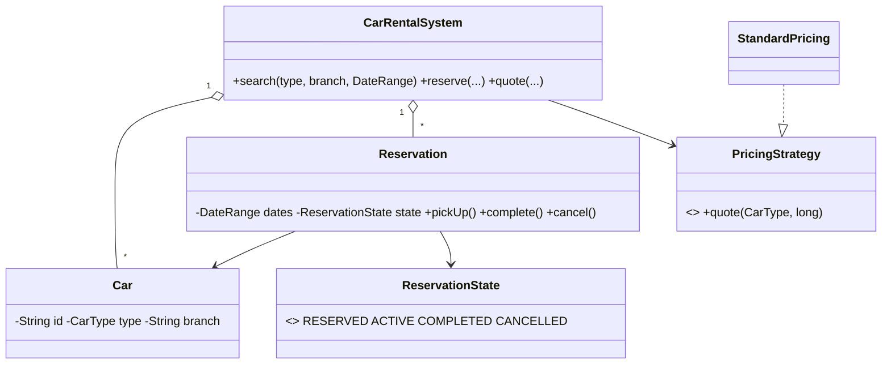

# Design Car Rental System — Concept

## What Is It?

A **car rental** where customers search a fleet by **type + branch + date range**, reserve a car, pick it up, and return it. The canonical Medium availability problem — half-open date ranges decide *who can book what when*, and pricing rules plug in as strategies.

| | |
|---|---|
| **Difficulty** | Medium |
| **Patterns** | State, Strategy |
| **Core** | date-range overlap over a reservation ledger; RESERVED → ACTIVE → COMPLETED |

---

## Requirements

**Functional**
- **Search** available cars by type, pickup branch, and date range.
- **Reserve** a car (fails if an overlapping reservation holds it); **pick up** and **return** it.
- Reservation lifecycle: `RESERVED → ACTIVE → COMPLETED`, or `CANCELLED` before pickup.
- **Quote** a price by car type and rental duration (discounts for long rentals).

**Non-functional**
- Two overlapping reservations for the same car must be impossible.
- Pricing rules (season, duration, extras) plug in without touching the fleet.

---

## Core Entities

| Entity | Responsibility |
|--------|----------------|
| `CarRentalSystem` (facade) | Fleet registry, search, reserve, quote |
| `Car` | Id, type, branch — identity only, no `isRented` flag |
| `DateRange` | Half-open `[start, end)`; `overlaps` is the heart of availability |
| `Reservation` | Car + customer + dates + state machine |
| `ReservationState` | `RESERVED / ACTIVE / COMPLETED / CANCELLED` with guarded moves |
| `PricingStrategy` | `quote(type, days)` — standard, seasonal, extras |

---

## Class Diagram

---

## Related

- [[../00 - Index|Medium Problems Index]]
- [[../../00 - Index|LLD Problems Index]]
- [[../../../00 - Index|LLD Main Index]]
- [[../../../Patterns/Behavioural/15 - Strategy/Concept|Strategy]] · [[../../../Patterns/Behavioural/17 - State/Concept|State]] · [[../Design-Hotel-Management-System/Concept|Hotel Management]]

---

#lld #machine-coding #car-rental #medium #concept