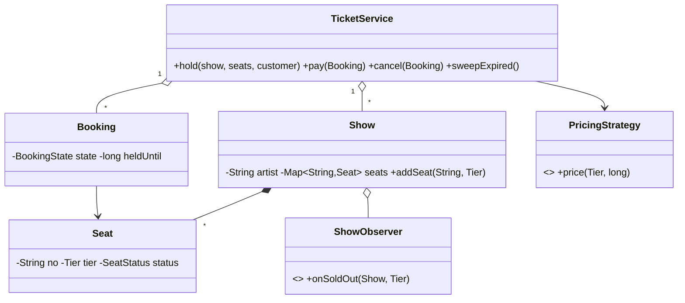

# Design a Concert Ticket Booking System — Concept

## What Is It?

A **concert ticketing service**: shows are seated by **tiers** (general, silver, gold, VIP), fans **hold** seats briefly while paying, and unpaid holds expire back to the pool. The canonical Medium seat-race problem — the hold TTL is the whole game.

| | |
|---|---|
| **Difficulty** | Medium |
| **Patterns** | State, Strategy, Observer |
| **Core** | seat hold with TTL + tier pricing + booking state machine |

---

## Requirements

**Functional**
- Create **shows** (artist, venue, date) with tiered, numbered seats.
- **Hold** seats for a customer (temporary); **pay** to confirm; **cancel** to release.
- Booking lifecycle: `PENDING → CONFIRMED → CANCELLED`; expired holds auto-release.
- **Tier pricing** (Strategy) — early-bird discounts, last-minute surges.
- **Sold-out alerts** — observers hear when a tier sells out.

**Non-functional**
- Seats are never sold twice under concurrent holds; expired holds free themselves.

---

## Core Entities

| Entity | Responsibility |
|--------|----------------|
| `TicketService` (facade) | Shows, holds, payment, expiry sweep |
| `Show` | Artist, venue, date, seat map |
| `Seat` | Number, tier, `FREE / HELD / SOLD` |
| `Booking` | Customer, seats, state, `heldUntil` |
| `PricingStrategy` | Price for (tier, days-to-show) |
| `ShowObserver` | Sold-out alerts per tier |

---

## Class Diagram

---

## Related

- [[../00 - Index|Medium Problems Index]]
- [[../../00 - Index|LLD Problems Index]]
- [[../../../00 - Index|LLD Main Index]]
- [[../../../Patterns/Behavioural/17 - State/Concept|State]] · [[../../../Patterns/Behavioural/15 - Strategy/Concept|Strategy]] · [[../Design-Airline-Management-System/Concept|Airline Management]]

---

#lld #machine-coding #concert #medium #concept