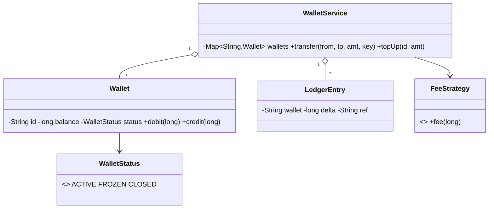

# Design a Digital Wallet Service — Concept

## What Is It?

A **prepaid wallet** with a balance and a status (active / frozen / closed), where money moves between wallets through **atomic, idempotent transfers** recorded on an immutable ledger. The canonical Medium money-movement problem — no double-spend, both sides or neither, retries safe.

| | |
|---|---|
| **Difficulty** | Medium |
| **Patterns** | State, Command, Strategy |
| **Core** | double-entry ledger + one atomic transfer boundary + idempotency keys |

---

## Requirements

**Functional**
- **Create wallets**; **top up**, **pay**, **transfer** between wallets; read **balance** and **statement**.
- **Freeze / unfreeze / close** a wallet; frozen wallets reject all outgoing money.
- Every movement writes **two immutable ledger entries** (debit + credit) under one transfer reference.
- **Idempotency** — resubmitting the same transfer key applies the money once.

**Non-functional**
- No double-spend under concurrent transfers; no half-applied transfers.
- Fees plug in as a strategy; the ledger is append-only.

---

## Core Entities

| Entity | Responsibility |
|--------|----------------|
| `WalletService` (facade) | Transfer orchestration, idempotency store, ledger |
| `Wallet` | Id, balance; guarded `debit`/`credit` by status |
| `WalletStatus` | `ACTIVE / FROZEN / CLOSED` |
| `LedgerEntry` (Command) | Immutable `{wallet, delta, ref, at}` record |
| `FeeStrategy` | Fee for a transfer amount |
| `applied` set | Idempotency keys of completed transfers |

---

## Class Diagram

---

## Related

- [[../00 - Index|Medium Problems Index]]
- [[../../00 - Index|LLD Problems Index]]
- [[../../../00 - Index|LLD Main Index]]
- [[../../../Patterns/Behavioural/17 - State/Concept|State]] · [[../../../Patterns/Behavioural/15 - Strategy/Concept|Strategy]] · [[../Design-ATM/Concept|ATM]]

---

#lld #machine-coding #wallet #medium #concept