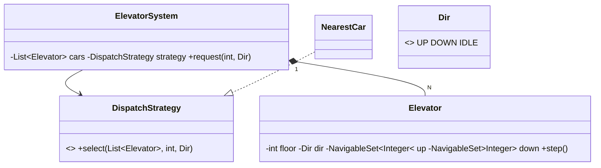

# Design an Elevator System — Concept

## What Is It?

A bank of **N elevator cars** serving floors, driven by **external requests** (the call button on floor 5 going up) and **internal requests** (a destination pressed inside a car). The canonical Medium scheduling problem — each car is a LOOK sweep over two sorted stop sets, and one dispatcher decides *which* car answers.

| | |
|---|---|
| **Difficulty** | Medium |
| **Patterns** | State, Strategy, Singleton |
| **Core** | two sorted stop sets per car (LOOK) + one dispatch strategy for the fleet |

---

## Requirements

**Functional**
- **External request** (floor, direction) and **internal request** (destination) can arrive at any time.
- A car serves all stops in its sweep direction before reversing (LOOK); doors open at every requested stop.
- An operator can take a car **out of service** and back.

**Non-functional**
- No request is lost; a stop already queued is never duplicated; idle cars are preferred over busy ones.
- The dispatching policy is swappable (nearest, scan, zone) without touching car logic.

---

## Core Entities

| Entity | Responsibility |
|--------|----------------|
| `ElevatorSystem` (Singleton) | Fleet + dispatch strategy; `request` routes to a chosen car |
| `Elevator` | Position, direction, two sorted stop sets; `request`, `step` |
| `Direction` | `UP / DOWN / IDLE` |
| `DispatchStrategy` (interface) | Picks the car for an external request |
| `NearestCar` | Closest floor wins; busy cars carry a penalty |
| `ElevatorState` (extension) | `IDLE / MOVING / DOORS_OPEN` when behavior grows |

---

## Class Diagram

---

## Related

- [[../00 - Index|Medium Problems Index]]
- [[../../00 - Index|LLD Problems Index]]
- [[../../../00 - Index|LLD Main Index]]
- [[../../../Patterns/Behavioural/15 - Strategy/Concept|Strategy]] · [[../../../Patterns/Behavioural/17 - State/Concept|State]]

---

#lld #machine-coding #elevator #medium #concept