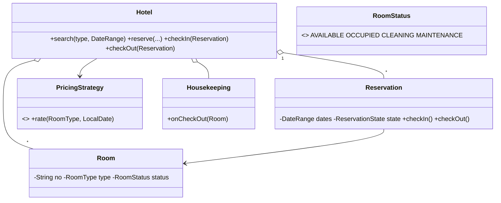

# Design Hotel Management System — Concept

## What Is It?

A **hotel front desk**: rooms of different types are booked for date ranges, guests check in and out, and every checkout triggers housekeeping. The same overlap ledger as car rental — plus a **room status lifecycle** (`AVAILABLE → OCCUPIED → CLEANING → AVAILABLE`) and seasonal pricing.

| | |
|---|---|
| **Difficulty** | Medium |
| **Patterns** | State, Strategy, Observer |
| **Core** | reservation overlap per room + room-status state machine + checkout bill |

---

## Requirements

**Functional**
- **Search** rooms by type and date range; **reserve**, **check in**, **check out**.
- Room status lifecycle: `AVAILABLE → OCCUPIED → CLEANING → AVAILABLE`; `MAINTENANCE` blocks booking.
- **Checkout bill** — nightly rate per day (weekend/season multipliers), printed at checkout.
- **Housekeeping** is notified automatically when a guest checks out.

**Non-functional**
- No room is ever double-booked for overlapping dates.
- Pricing rules and housekeeping actions plug in without touching the front desk.

---

## Core Entities

| Entity | Responsibility |
|--------|----------------|
| `Hotel` (facade) | Room registry, reservation ledger, check-in/out, billing |
| `Room` | Number, type, live `RoomStatus` |
| `Reservation` | Room + guest + dates; `RESERVED → CHECKED_IN → CHECKED_OUT` |
| `RoomStatus` | `AVAILABLE / OCCUPIED / CLEANING / MAINTENANCE` |
| `PricingStrategy` | Nightly rate for (type, date) — weekend/season aware |
| `Housekeeping` (Observer) | Turns a checked-out room to `CLEANING` |

---

## Class Diagram

---

## Related

- [[../00 - Index|Medium Problems Index]]
- [[../../00 - Index|LLD Problems Index]]
- [[../../../00 - Index|LLD Main Index]]
- [[../../../Patterns/Behavioural/14 - Observer/Concept|Observer]] · [[../../../Patterns/Behavioural/15 - Strategy/Concept|Strategy]] · [[../Design-Car-Rental-System/Concept|Car Rental]]

---

#lld #machine-coding #hotel #medium #concept