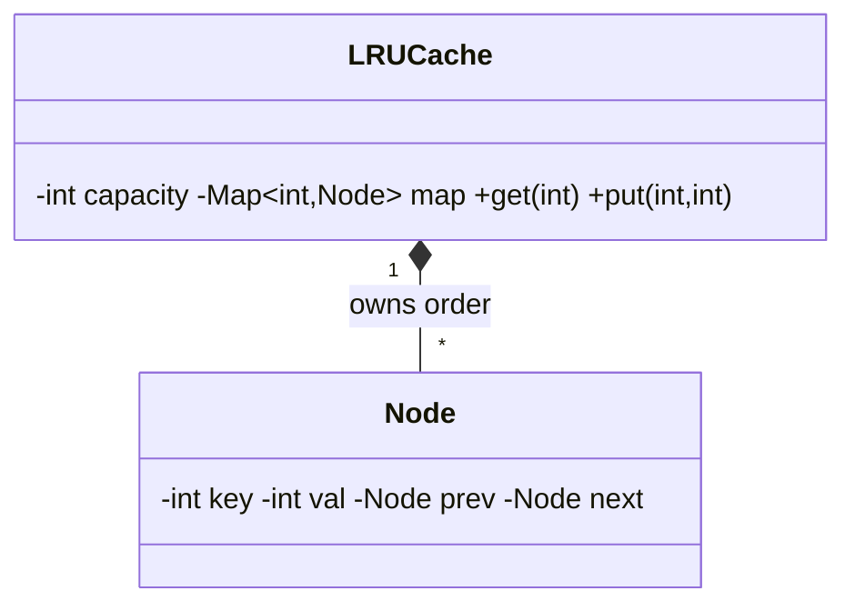

# Design LRU Cache — Concept

## What Is It?

A fixed-capacity cache with O(1) `get`/`put` that evicts the **least-recently-used** entry past capacity. The canonical Medium data-structure problem — HashMap for lookup, doubly-linked list for order, one lock for sanity.

| | |
|---|---|
| **Difficulty** | Medium |
| **Patterns** | (Data structure — doubly-linked list + HashMap) |
| **Core** | map key → node; list head = MRU, tail = LRU; every access splices to head |

---

## Requirements

**Functional**
- `get(key)` returns value, refreshes recency; miss returns −1.
- `put(key, value)` inserts/updates, refreshes; evicts LRU past capacity.

**Non-functional**
- O(1) both ops; eviction-after-insert in exactly one place; thread-safe variant with a single lock.

---

## Core Entities

| Entity | Responsibility |
|--------|----------------|
| `LRUCache` | Capacity, map, sentinel head/tail, `get`/`put` under one lock |
| `Node` | Key + value + prev/next; key lives in the node so eviction deletes from the map |
| `EvictionPolicy` (extension) | LRU now; LFU/TTL later without touching `LRUCache` |

---

## Class Diagram

---

## Related

- [[../00 - Index|Medium Problems Index]]
- [[../../00 - Index|LLD Problems Index]]
- [[../../../00 - Index|LLD Main Index]]
- [[../Design-ATM/Concept|ATM]] · [[../../../Concurrency/Problems/Thread-Safe-Cache-with-TTL/Concept|TTL Cache]]

---

#lld #machine-coding #lru-cache #medium #concept
