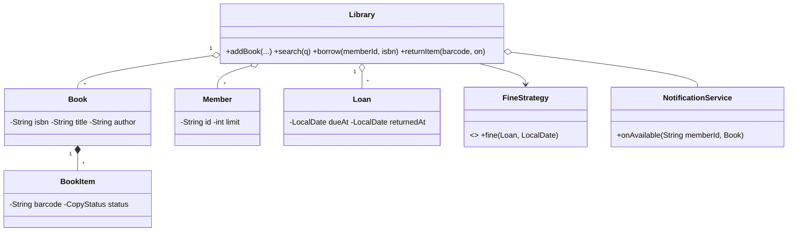

# Design a Library Management System — Concept

## What Is It?

A **library**: books exist as multiple physical **copies**, members borrow them for a due date, returns compute **fines** when late, and popular books grow a **reservation queue**. The canonical Medium CRUD-plus-workflow problem — inventory, membership rules, and a waiting list.

| | |
|---|---|
| **Difficulty** | Medium |
| **Patterns** | State, Strategy, Observer |
| **Core** | copy-status machine (AVAILABLE → LOANED → RESERVED) + fine strategy + FIFO waitlist |

---

## Requirements

**Functional**
- **Catalogue**: add books (with one or many copies), search by title / author / ISBN.
- **Borrow** a copy (member limit, only when a copy is free); **return** it (fines if late); **renew**.
- **Reserve** a book when all copies are out — FIFO waitlist; the first waiter is notified on return.
- **Fines** by days overdue (pluggable strategy).

**Non-functional**
- A copy is never loaned to two members; waitlist order is stable; every transition is queryable.

---

## Core Entities

| Entity | Responsibility |
|--------|----------------|
| `Library` (facade) | Catalogue, members, loans, waitlists |
| `Book` | Title, author, ISBN — the metadata |
| `BookItem` (copy) | Barcode + live status `AVAILABLE / LOANED / RESERVED / LOST` |
| `Member` | Borrowing limit + active loans |
| `Loan` | Item, member, due date, return date |
| `FineStrategy` | Fine for a late return |
| `NotificationService` (Observer) | Tells the next waiter a copy is free |

---

## Class Diagram

---

## Related

- [[../00 - Index|Medium Problems Index]]
- [[../../00 - Index|LLD Problems Index]]
- [[../../../00 - Index|LLD Main Index]]
- [[../../../Patterns/Behavioural/15 - Strategy/Concept|Strategy]] · [[../../../Patterns/Behavioural/14 - Observer/Concept|Observer]] · [[../../../Patterns/Behavioural/17 - State/Concept|State]]

---

#lld #machine-coding #library #medium #concept