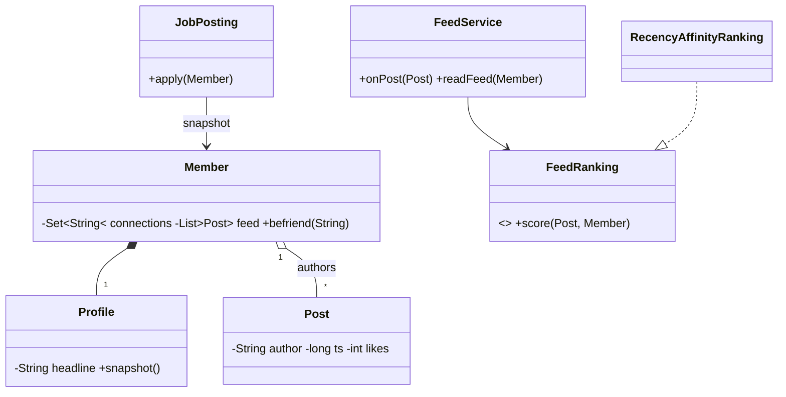

# Design LinkedIn — Concept

## What Is It?

A professional network where **members** maintain **profiles**, form **directed connection edges**, publish **posts** to a **ranked feed**, post/apply to **jobs**, and receive **notifications**. The canonical Medium Observer problem — post once, fan out to thousands, rank on read.

| | |
|---|---|
| **Difficulty** | Medium |
| **Patterns** | Observer, Strategy |
| **Core** | members ⇄ connections ⇄ posts → feed; jobs + notifies ride the same event shape |

---

## Requirements

**Functional**
- **Profiles** with headline, skills, experience; editable without rewriting history.
- **Invite / accept** connections; 1st/2nd-degree derived by BFS over mutual edges.
- **Posts** with like/comment; **feed** ranked by engagement × affinity ÷ age.
- **Jobs**: recruiter posts, member applies with profile snapshot, recruiter notified.

**Non-functional**
- Posting must return fast — fan-out is async; ranking is pluggable (`FeedRanking`).
- Degree/reach derived from the graph, never stored as a counter.

---

## Core Entities

| Entity | Responsibility |
|--------|----------------|
| `Member` | Profile + connection edge set + personal feed inbox |
| `Profile` | Headline, skills, experience; `snapshot()` for applications |
| `Connection` | Directed invite edge; PENDING → ACCEPTED makes it mutual |
| `Post` | Author, text, timestamp, likes, comments |
| `FeedService` (Observer) | `onPost` fans out to 1st degree; `readFeed` ranks |
| `FeedRanking` (Strategy) | Scores a post for a reader |
| `JobPosting` | Title + recruiter + application snapshots |
| `NotificationService` | Job/connection/mention notifies |

---

## Class Diagram

---

## Related

- [[../00 - Index|Medium Problems Index]]
- [[../../00 - Index|LLD Problems Index]]
- [[../../../00 - Index|LLD Main Index]]
- [[../../../Patterns/Behavioural/14 - Observer/Concept|Observer]] · [[../../../Patterns/Behavioural/15 - Strategy/Concept|Strategy]]

---

#lld #machine-coding #linkedin #medium #concept
